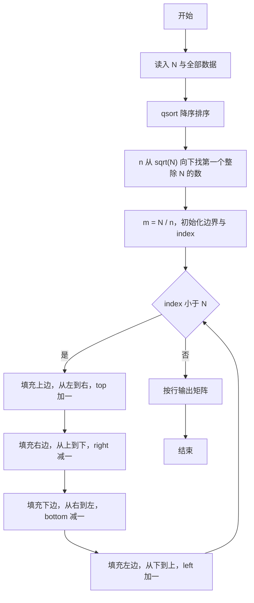
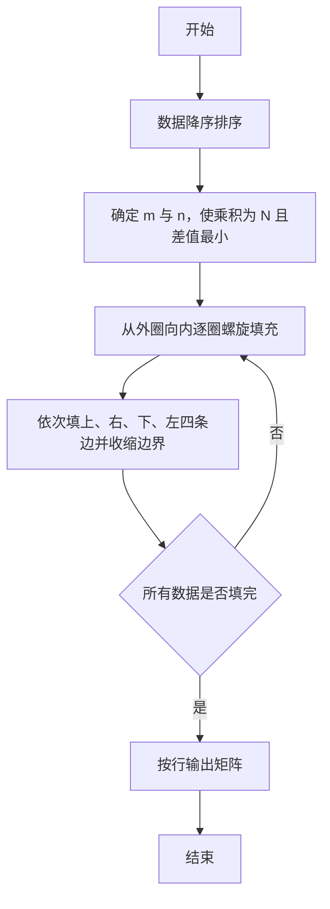

# 1050 螺旋矩阵 详解

### 解题思路
- 要求把 N 个数按从大到小填入 m 行 n 列的螺旋矩阵：m×n = N、m ≥ n 且 m-n 最小。
- 从 sqrt(N) 向下枚举 n，第一个能整除 N 的 n 即满足条件（此时 m = N/n ≥ n 且差值最小）。
- 数组先降序排序，再用"边界收缩"法模拟螺旋填充：依次填上边（左→右）、右边（上→下）、下边（右→左）、左边（下→上），每填完一边就收缩对应边界，直到所有 N 个数填完。
- 每个方向循环里都带 index < N 判断，防止最后一个数重复填充。排序 O(N log N)，填充 O(N)。

### 代码流程说明
- 定义降序比较函数 cmp（返回 b 减 a），读入 N 与全部数据后 qsort 降序排序。
- 求行列数：for 循环让 n 从 sqrt(N) 向下递减，找到第一个满足 N % n == 0 的 n，令 m = N / n 后 break。
- 声明 matrix 矩阵并清零，设置 top、bottom、left、right 四个边界，index 指向待填入元素。
- while (index < N) 循环内依次执行四个方向填充：上边矩阵[top][j] 从左到右后 top++；右边 matrix[i][right] 从上到下后 right--；下边 matrix[bottom][j] 从右到左后 bottom--；左边 matrix[i][left] 从下到上后 left++。每个内层循环均带 index < N 条件。
- 按行输出矩阵，行内元素以空格分隔、行末无多余空格，最后换行结束。

### 代码流程图

### 解题流程图

