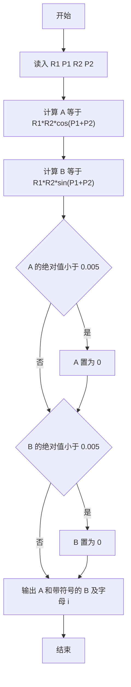
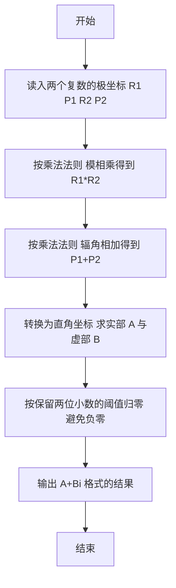

# 1051 复数乘法 详解

### 解题思路

1. 复数以极坐标形式 `R*(cos(P)+i*sin(P))` 给出，本题只要求计算两个复数相乘的结果，无需存数组，直接读入四个 double 即可。
2. 利用复数乘法的极坐标法则：模相乘、辐角相加，即 `(R1,P1)×(R2,P2) = (R1*R2, P1+P2)`。
3. 再将乘积从极坐标转换回直角坐标：实部 `A = R1*R2*cos(P1+P2)`，虚部 `B = R1*R2*sin(P1+P2)`。
4. 关键判断：浮点运算可能产生极小的非零值（如 `-0.00`），当 `|A| < 0.005` 或 `|B| < 0.005` 时强制置 0，保证四舍五入到两位小数后不出现负零。
5. 输出技巧：用格式符 `%+.2lf` 让虚部强制带正负号，天然拼出 `A+Bi` 或 `A-Bi` 的形式。
6. 时间复杂度 O(1)。

### 代码流程说明

1. 先用 `scanf` 一次性读入两个复数的极坐标参数 `R1、P1、R2、P2`。
2. 计算乘积的实部 `A = R1*R2*cos(P1+P2)` 和虚部 `B = R1*R2*sin(P1+P2)`，其中 `cos`、`sin` 来自 `<math.h>`。
3. 分别判断 `fabs(A)` 与 `fabs(B)` 是否小于 0.005，若小于则把对应值置 0，消除浮点误差造成的 `-0.00`。
4. 最后用 `printf("%.2lf%+.2lfi\n", A, B)` 输出：实部保留两位小数，虚部由 `%+` 自动加正负号，末尾补字母 `i`。

### 代码流程图

### 解题流程图

