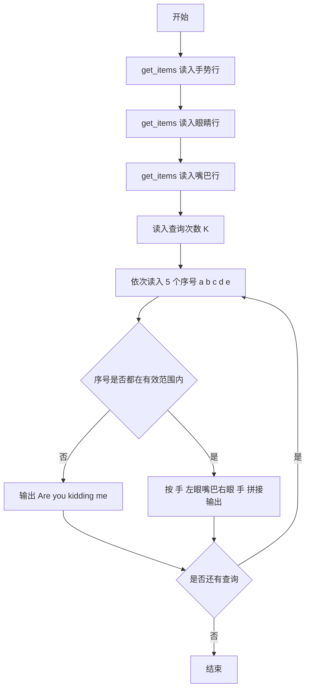
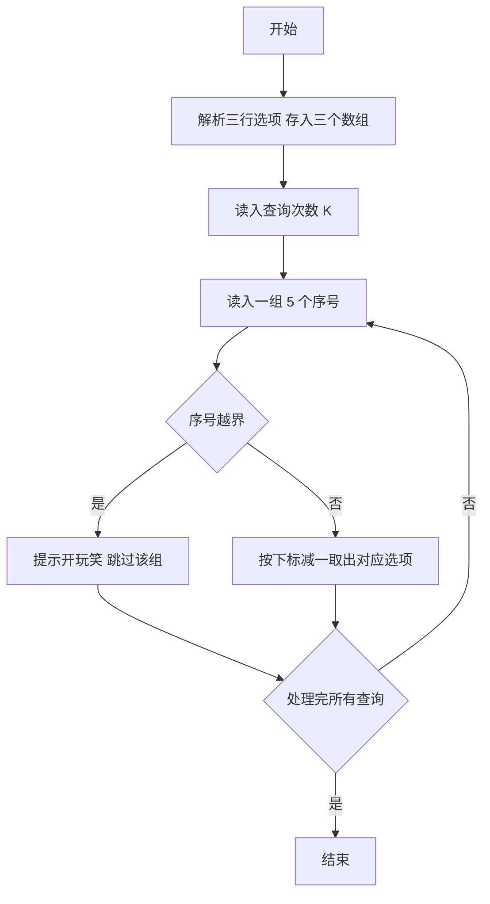

# 1052 卖个萌 详解

### 解题思路

1. 数据组织：用三个二维字符数组 `hand、eye、mouth` 分别存放手势、眼睛、嘴巴的所有选项，每个选项是最长 10 字符的字符串，最多 15 个选项。
2. 解析技巧：每行选项形如 `[...]`，`get_items` 函数逐字符读入，遇到 `[` 后用 `scanf("%[^]]", ...)` 读到 `]` 为止，恰好截取一个选项内容，行尾 `\n` 结束解析。
3. 输出规则：表情按"手(左眼嘴巴右眼)手"拼接，五个序号依次对应"手-眼-嘴-眼-手"。
4. 关键判断：序号从 1 开始而数组下标从 0 开始，必须校验每个序号是否在对应选项数范围内（1~count），任一越界即输出 `Are you kidding me? @\/@`。
5. 时间复杂度 O(K)，每行字符总量小，常数时间完成。

### 代码流程说明

1. 依次调用三次 `get_items` 读入三行选项，分别得到手势数 `h_count`、眼睛数 `e_count`、嘴巴数 `m_count`。
2. 读入查询次数 `K`，进入循环逐个处理查询。
3. 每次读入 5 个序号 `a、b、c、d、e`，其中 `a、e` 对应手势，`b、d` 对应眼睛，`c` 对应嘴巴。
4. 若任一序号小于 1 或大于对应选项总数，输出 `Are you kidding me? @\/@`；否则按 `hand[a-1](eye[b-1]mouth[c-1]eye[d-1])hand[e-1]` 拼接输出表情。

### 代码流程图

### 解题流程图

