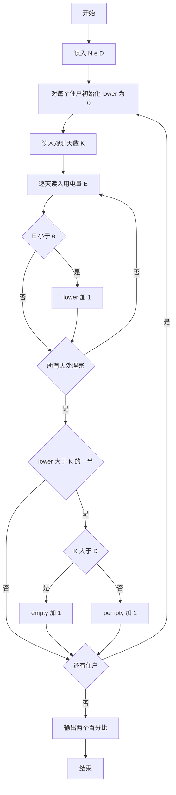
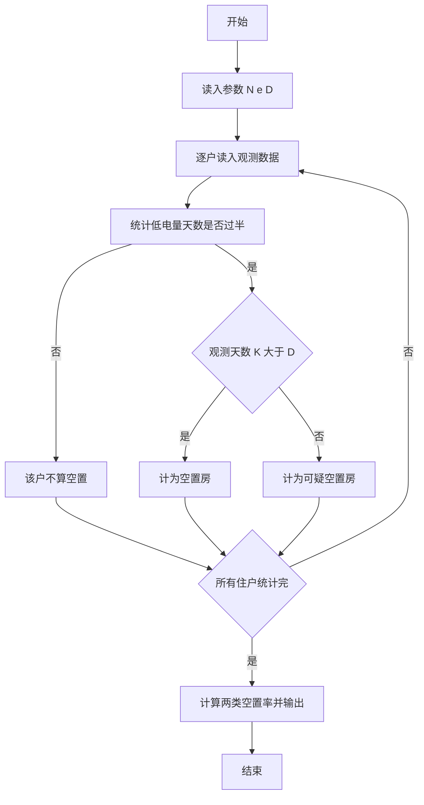

# 1053 住房空置率 详解

### 解题思路

1. 数据组织：无需存储任何住户的历史数据，逐户读入、逐户统计即可，只需维护两个计数器 `empty`（空置房）和 `pempty`（可疑空置房）。
2. 对每个住户，先读入其观测天数 `K`，再逐天读入用电量 `E`，统计用电量低于阈值 `e` 的天数 `lower`。
3. 关键判断一：`lower > K/2` 表示超过一半的观测天用电量低于阈值，这是两类空置房的公共前提。
4. 关键判断二：在满足低电量天数过半的基础上，若观测天数 `K > D` 判定为空置房，否则判定为可疑空置房。
5. 结果输出：两种比例均按 `计数 * 100.0 / N` 保留一位小数，注意 `%%` 转义输出百分号。
6. 时间复杂度 O(ΣK)，仅需一轮读取。

### 代码流程说明

1. 读入住户总数 `N`、用电阈值 `e`、空置判定阈值 `D`。
2. 进入 N 次循环，每轮先将 `lower` 清零，读入该户观测天数 `K`。
3. 内层循环读入 `K` 天的用电量 `E`，凡 `E < e` 则 `lower` 自增。
4. 若 `lower > K/2` 且 `K > D`，`empty` 加一；否则若 `lower > K/2`，`pempty` 加一。
5. 循环结束后输出 `pempty*100.0/N` 与 `empty*100.0/N` 两个百分比，均保留一位小数。

### 代码流程图

### 解题流程图

