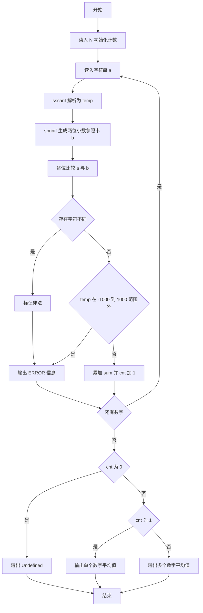
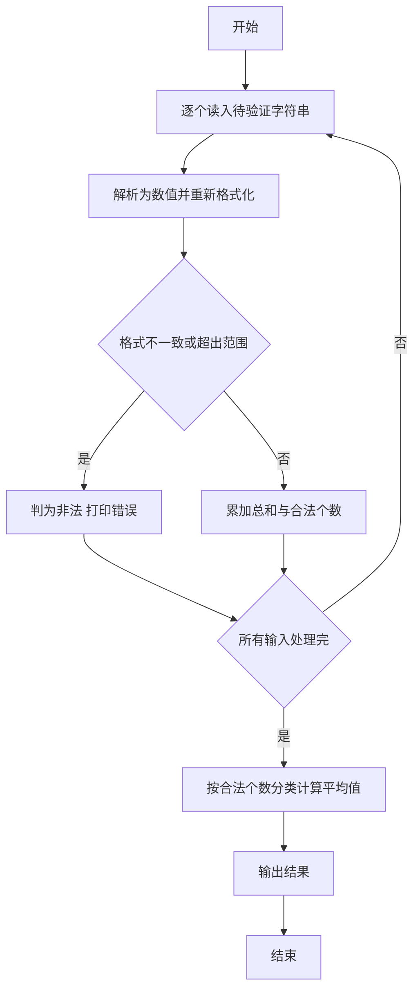

# 1054 求平均值 详解

### 解题思路

1. 合法性判定思路：题目要求数字必须在 [-1000, 1000] 范围内且最多两位小数，代码用"字符串往返比对"来判定格式是否合法——先用 `sscanf` 把字符串解析成 double，再用 `sprintf` 按保留两位小数重新格式化，若原串与格式化结果逐字符一致，说明输入就是最多两位小数的合法数字（如 `1.`、`1.234` 会暴露差异）。
2. 数据组织：用 `sum` 累加合法数字，`cnt` 统计合法数字个数，`a` 存原始输入串，`b` 存格式化参考串。
3. 关键判断一：逐位比较 `a` 与 `b`，任一位置字符不同即判非法，并输出 `ERROR: xxx is not a legal number`。
4. 关键判断二：即便格式合法，若数值超出 [-1000, 1000] 仍判非法。
5. 输出分支：无合法数字输出 `Undefined`，仅 1 个输出单数形式，否则输出平均值（保留两位小数），注意英文单复数的措辞差异。
6. 时间复杂度 O(N·L)，L 为字符串长度。

### 代码流程说明

1. 读入个数 `N`，初始化 `cnt = 0`、`sum = 0.0`。
2. 循环 N 次：读入字符串 `a`，用 `sscanf(a, "%lf", &temp)` 解析数值，再用 `sprintf(b, "%.2lf", temp)` 生成两位小数的参照串。
3. 用 `flag` 标记：逐位比较 `a[j]` 与 `b[j]`，一旦不同置 `flag = 1` 并跳出。
4. 若 `flag` 为真或 `temp` 超出 [-1000, 1000]，打印 ERROR 信息；否则 `sum += temp`、`cnt++`。
5. 结束后按 `cnt` 的值分三种情况输出：0 个、1 个、多个，平均值取 `sum/cnt` 保留两位小数。

### 代码流程图

### 解题流程图

