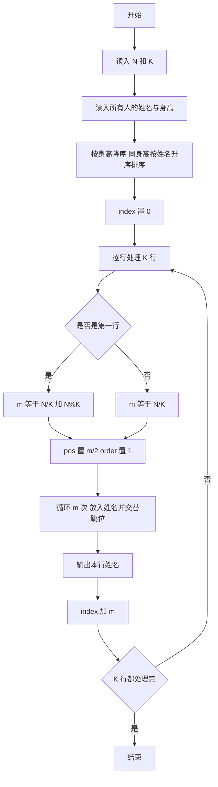
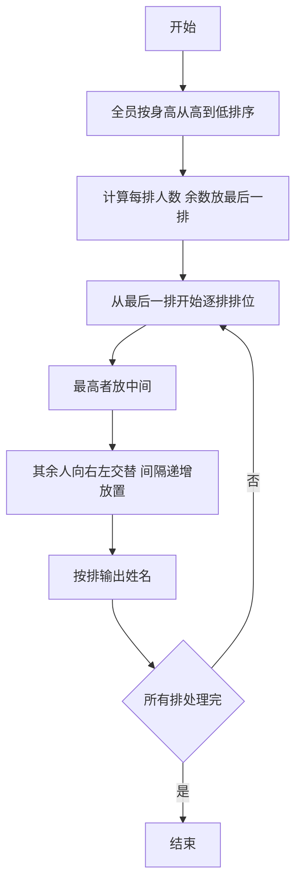

# 1055 集体照 详解

### 解题思路

1. 数据组织：定义结构体 `Person` 存姓名与身高，读入所有人后统一排序；排序规则为身高降序，身高相同时按姓名升序，保证"身高相同时名字字典序小的排前面"。
2. 行数分配：最后一排（输出时最先处理的行）人数为 `N/K + N%K`，其余每排 `N/K` 人，多余的人全部放在最后一排。
3. 站位技巧：每排最高的人站中间，其余按从高到低的顺序"向右、向左、再向右、再向左"交替摆放，落脚点间隔依次为 1、2、3、…格，用变量 `pos` 记录当前落脚位置、`order` 控制方向（1 向右、-1 向左）。
4. 关键公式：中间位置 `pos = m/2`；第 i 个人放好后，下一步位置 `pos += order*(i+1)` 并翻转方向，恰好把矮的人安排在中间人两侧由近及远。
5. 输出控制：每行姓名用空格分隔、行尾无多余空格，`index` 变量指向排序数组中下一行的起点。
6. 时间复杂度 O(N log N)（排序）＋ O(N)（排版）。

### 代码流程说明

1. 读入总人数 `N` 与排数 `K`，将所有人的姓名、身高读入 `arr` 数组。
2. 调用 `qsort` 按 `cmp` 规则排序：身高不同取身高差降序，身高相同按 `strcmp` 姓名升序。
3. `index` 初始为 0，从最后一排开始逐行处理：第一行人数 `m = N/K + N%K`，其余行 `m = N/K`。
4. 对每一行：`pos = m/2`、`order = 1`，循环 `m` 次，把 `arr[index+i]` 的姓名拷贝到 `row[pos]`，再按 `pos += order*(i+1)` 并翻转 `order` 走到下一个位置。
5. 输出该行所有 `row` 中的姓名，行内以空格分隔；`index += m` 进入下一行。
6. 全部 K 行输出完毕即结束。

### 代码流程图

### 解题流程图

