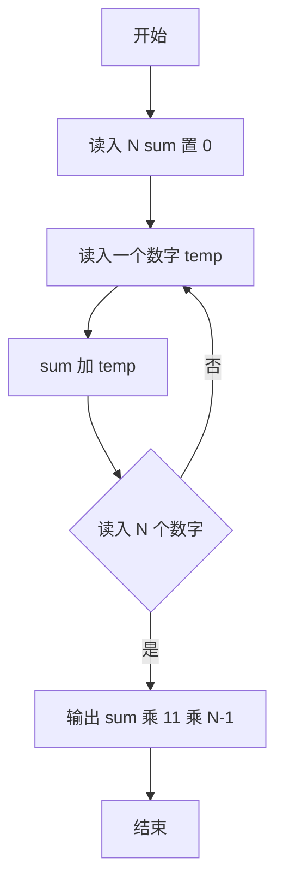
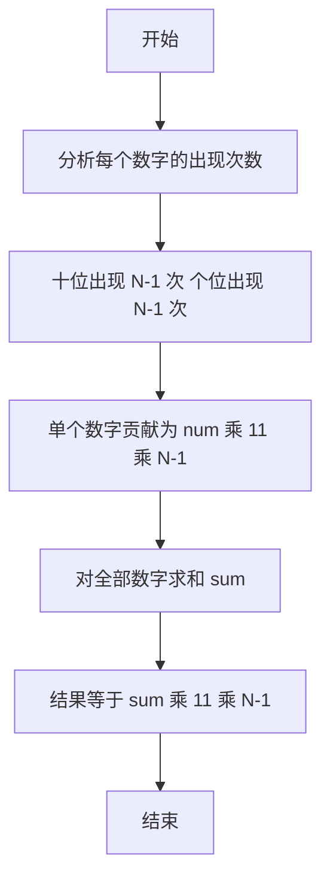

# 1056 组合数的和 详解

### 解题思路

1. 数学推导：所有由给定 N 个数字组成的 2 位数中，每个数字在十位出现 N-1 次（与其余 N-1 个数字各组合一次），在个位同样出现 N-1 次。
2. 因此单个数字 num 的总贡献为 `num*10*(N-1) + num*1*(N-1) = num*11*(N-1)`，与其它数字的具体取值无关。
3. 算法因此简化为：只需求出所有数字的和 `sum`，答案即为 `sum * 11 * (N-1)`，无需枚举组合。
4. 注意题目给出的数字均为个位数（0~9 以内），不会出现进位或位数纠缠，直接累加即可。
5. 时间复杂度 O(N)，空间复杂度 O(1)。

### 代码流程说明

1. 读入数字个数 `N`，初始化 `sum = 0`。
2. 循环 N 次，每次读入一个数字 `temp` 并累加到 `sum`。
3. 输出 `sum * 11 * (N-1)` 作为所有 2 位数组合的和。

### 代码流程图

### 解题流程图

