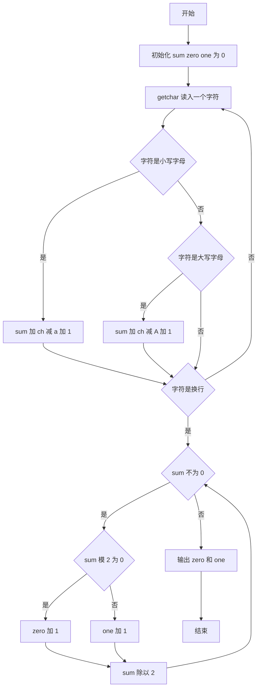
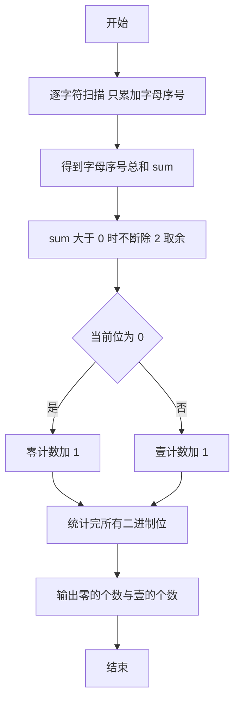

# 1057 数零壹 详解

### 解题思路

1. 字母转数字：大小写字母统一处理，`a/A` 对应 1、`b/B` 对应 2、…、`z/Z` 对应 26，即字母序号 `ch - 'a' + 1` 或 `ch - 'A' + 1`。
2. 只处理英文字母，其余字符（数字、空格、标点）一律忽略，逐字符读入并累加得到总和 `sum`。
3. 二进制转换：用"除 2 取余"法逐位分解 `sum`，余数 0 时 `zero` 加一，余数 1 时 `one` 加一，同时 `sum /= 2` 直到其为 0。
4. 输出顺序：先输出 0 的个数再输出 1 的个数，中间以空格分隔。
5. 边界情况：若字符串中没有任何字母，`sum = 0`，循环一次都不进入，输出 `0 0`，符合题意。
6. 时间复杂度 O(L)，L 为字符串长度。

### 代码流程说明

1. 初始化 `sum = 0`、`zero = 0`、`one = 0`。
2. 用 `getchar()` 逐字符读入直到换行符：小写字母累加 `ch-'a'+1`，大写字母累加 `ch-'A'+1`，其他字符跳过。
3. `while (sum)` 循环：`sum % 2` 为 0 则 `zero++`，否则 `one++`，随后 `sum /= 2`。
4. 循环结束输出 `printf("%d %d\n", zero, one)`。

### 代码流程图

### 解题流程图

