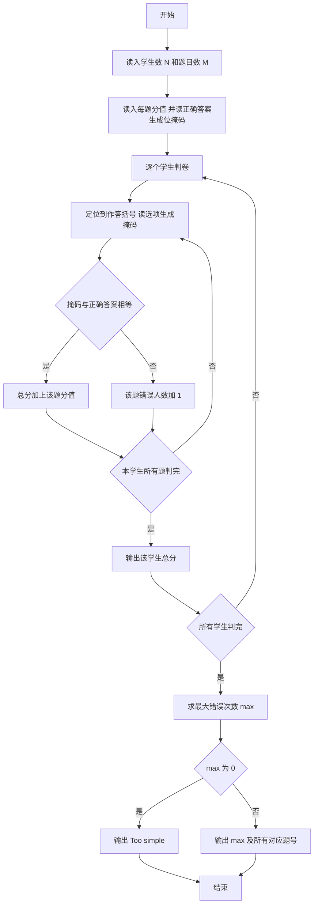
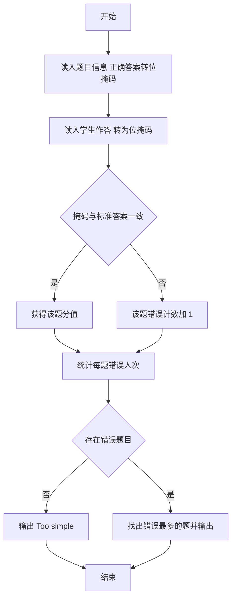

# 1058 选择题 详解

### 解题思路

1. 数据组织：结构体 `Problem` 保存每道题的分值 `score`、正确答案位掩码 `answer` 和答错人数 `wrong`。
2. 核心技巧——位掩码：每个选项用二进制的一位表示（`a`~`e` 对应第 0~4 位），读入选项时执行 `ans |= 1 << (c - 'a')`，判卷时只需比较两个整数是否相等，免去逐字符比较。
3. 判卷规则：学生作答掩码与正确答案掩码完全相等才得分，否则该题 `wrong` 计数加一。
4. 输入解析：读题时用 `read_answer()` 跳过选项前的空格；读学生作答时先定位到 `(`，读完选项后跳过后面的 `)` 与空格，保证逐题推进。
5. 统计输出：求出所有题 `wrong` 的最大值，若为 0 输出 `Too simple`，否则输出最大错误次数及所有错误次数达到该值的题号（升序、空格分隔）。
6. 时间复杂度 O(N·M)，M 为题目数。

### 代码流程说明

1. 读入学生数 `N` 与题目数 `M`。
2. 循环读入每道题：`scanf` 读分值 `score` 与选项个数（存入无用的 `useless`），调用 `read_answer()` 读正确答案得到位掩码，`wrong` 初始化为 0。
3. 逐个学生判卷：每读一题前用 `getchar` 循环定位到 `(`，读作答选项个数与各选项字母构造掩码，再跳过 `)`。
4. 若掩码与 `answer` 相等则 `score += pro[j].score`，否则 `pro[j].wrong++`；该学生所有题判完后输出其总分。
5. 所有学生处理完后求 `max_wrong`：为 0 输出 `Too simple`，否则先输出 `max_wrong`，再遍历输出所有 `wrong == max_wrong` 的题号（`i+1`）。

### 代码流程图

### 解题流程图

