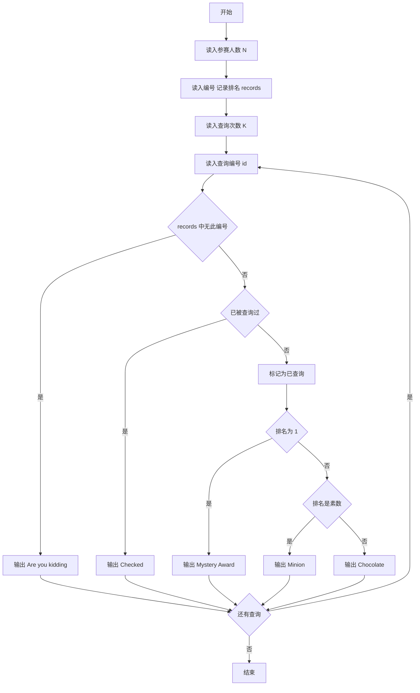
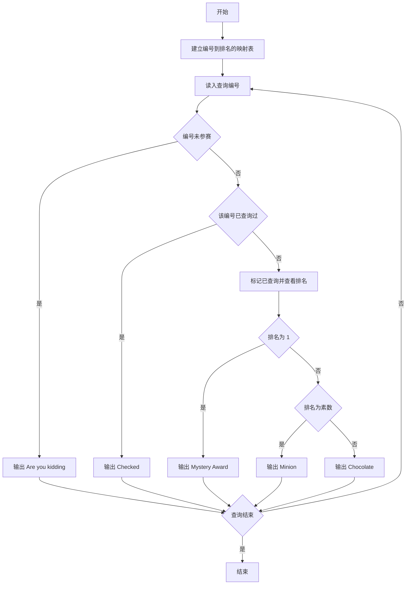

# 1059 C语言竞赛 详解

### 解题思路

1. 数据组织：用数组 `records` 以下标作为参赛编号、值作为排名（1 开始），未参赛者值为 0；用数组 `checked` 标记编号是否已被查询过。
2. 查表思想：编号范围有限（小于 10000），直接按下标存取实现 O(1) 查询，无需排序或哈希。
3. 判定顺序（关键，顺序不能颠倒）：先查"是否参赛"（records 为 0），再查"是否重复查询"（checked 已标记），最后按排名分冠军、素数名次、普通名次三种情况输出。
4. 素数判定：`is_prime` 先排除 1、偶数，再只试除到 `sqrt(x)` 的奇数，保证效率。
5. 输出格式：编号以 `%04d` 四位数补零输出，后接冒号、空格与奖项英文。
6. 时间复杂度：建表 O(N)，查询 O(K·√max_rank)。

### 代码流程说明

1. 读入参赛人数 `N`，循环读入每个编号 `id`，令 `records[id] = i`（i 从 1 到 N，即排名）。
2. 读入查询次数 `K`，循环读入被查询的编号 `id`。
3. 若 `records[id] == 0` 输出 `Are you kidding?`；否则若 `checked[id]` 为真输出 `Checked`；否则先置 `checked[id] = 1`。
4. 再根据排名分类：排名 1 输出 `Mystery Award`，排名是素数输出 `Minion`，否则输出 `Chocolate`。

### 代码流程图

### 解题流程图

