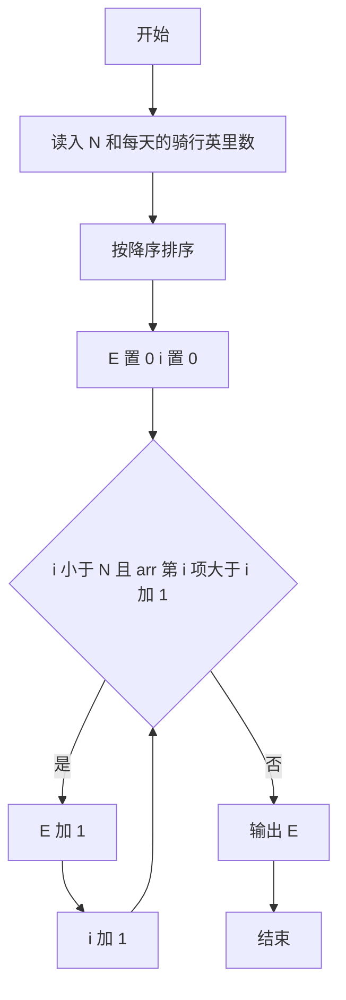
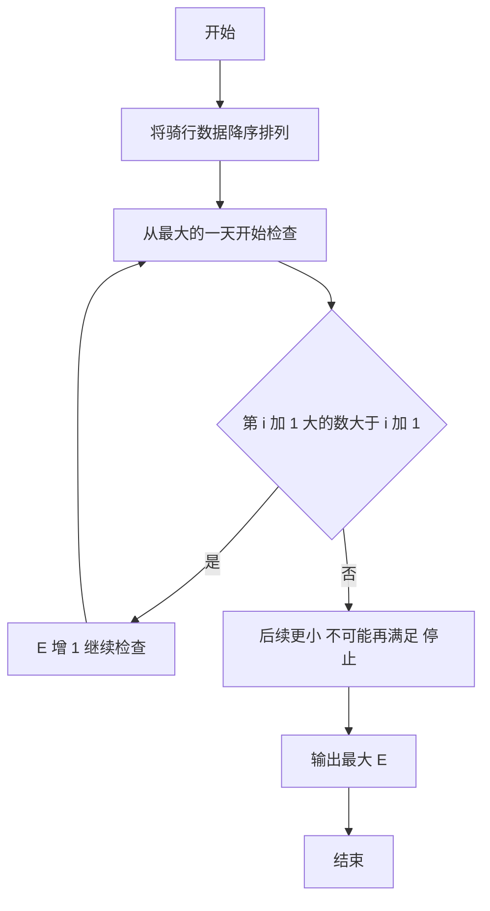

# 1060 爱丁顿数 详解

### 解题思路

1. 问题转化：要求最大的 E，使存在 E 天骑车超过 E 英里。把每天的骑行英里数降序排列后，条件等价于排序数组的第 E 个元素（下标 E-1）大于 E。
2. 排序依据：降序排列后，若第 i+1 大的数 `arr[i] > i+1`，说明前 i+1 天都至少大于 i+1，爱丁顿数可以取到 i+1。
3. 贪心/线性推进：从 `i = 0` 开始逐个检查，只要 `arr[i] > i+1` 就让 `E++` 继续；一旦遇到不满足的位置，由于数组已降序，之后的值只会更小，一定也不再满足，直接跳出。
4. 关键判断：比较的是"第 i+1 大的数是否大于 i+1"，而不是大于等于，符合题意"超过"的严格大于要求。
5. 时间复杂度 O(N log N)（排序主导），遍历部分 O(N)。

### 代码流程说明

1. 读入天数 `N` 和每天的骑行英里数存入 `arr`。
2. 用 `qsort` 按 `cmp` 把 `arr` 从大到小排序。
3. `E` 初始为 0，遍历 `i` 从 0 到 N-1：若 `arr[i] > i+1` 则 `E++`，否则 `break`。
4. 输出 `E`。

### 代码流程图

### 解题流程图

