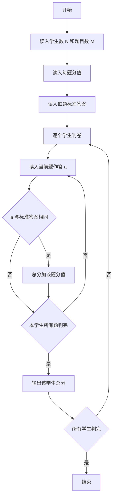
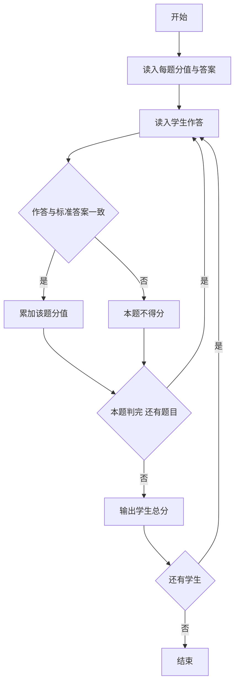

# 1061 判断题 详解

### 解题思路

1. 数据组织：两个并行数组 `weight`（每题分值）与 `answer`（每题标准答案 0/1），下标一一对应题目编号。
2. 判分规则：判断题非对即错，学生作答与标准答案相等即得该题满分，否则得 0 分。
3. 处理流程：先读入全部题目的分值与答案，再逐学生逐题读作答并累加总分，读完一个学生立即输出，无需存储学生数据。
4. 关键判断：`a == answer[j]` 成立则 `sum += weight[j]`。
5. 时间复杂度 O(N·M)，空间复杂度 O(M)。

### 代码流程说明

1. 读入学生数 `N` 与题目数 `M`。
2. 先循环读入每题分值到 `weight`，再循环读入每题标准答案到 `answer`。
3. 对每个学生：`sum` 初始为 0，逐题读入作答 `a`，若 `a == answer[j]` 则 `sum += weight[j]`。
4. 该学生所有题判完后输出总分 `sum`，接着处理下一位学生。

### 代码流程图

### 解题流程图

