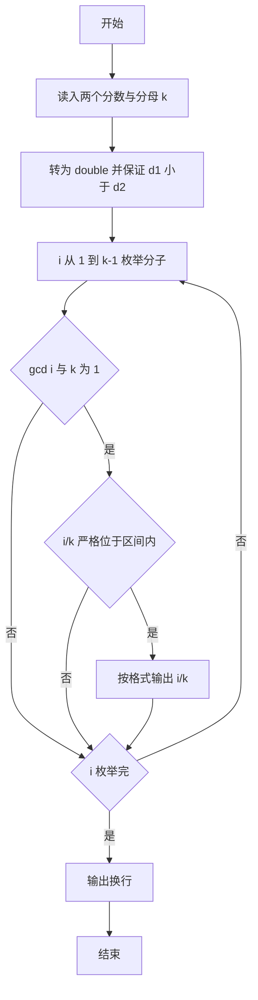
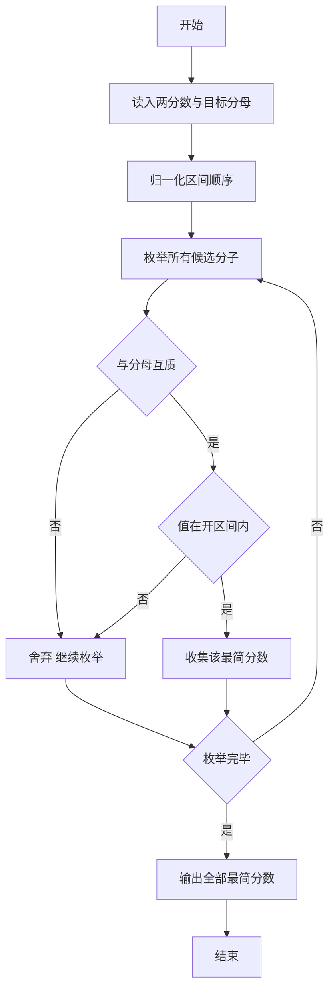

# 1062 最简分数 详解

### 解题思路

1. 问题转化：给定两个分数 `n1/m1`、`n2/m2` 与目标分母 `k`，枚举分子 `i`（1 到 k-1），找所有满足 `n1/m1 < i/k < n2/m2` 且 `i/k` 为最简分数的 `i`。
2. 最简判定：分子分母互质，即 `gcd(i, k) == 1`，用辗转相除法求最大公约数。
3. 顺序处理：先把两个分数转成 double 比较，若 `d1 > d2` 则交换，保证区间起点小于终点；枚举时要求严格介于两者之间（`d > d1 && d < d2`，不取等号）。
4. 范围依据：分子从 1 枚举到 k-1 即可，因为 0 与 1 不可能是严格位于开区间内的解，且分子不小于 k 时分数不小于 1，通常超出区间。
5. 输出格式：第一个分数前不加空格，后续每个分数前加一个空格，末尾换行。
6. 时间复杂度 O(k·log k)。

### 代码流程说明

1. 以 `%d/%d` 格式读入两个分数 `n1/m1`、`n2/m2` 以及目标分母 `k`。
2. 计算 `d1 = (double)n1/m1`、`d2 = (double)n2/m2`，若 `d1 > d2` 交换二者。
3. `first` 标记初始为 1，循环 `i` 从 1 到 k-1：
   - 若 `gcd(i, k) != 1` 跳过；
   - 否则计算 `d = (double)i/k`，若 `d > d1 && d < d2`，按 `first` 控制是否加前导空格后输出 `i/k`。
4. 循环结束输出换行。

### 代码流程图

### 解题流程图

