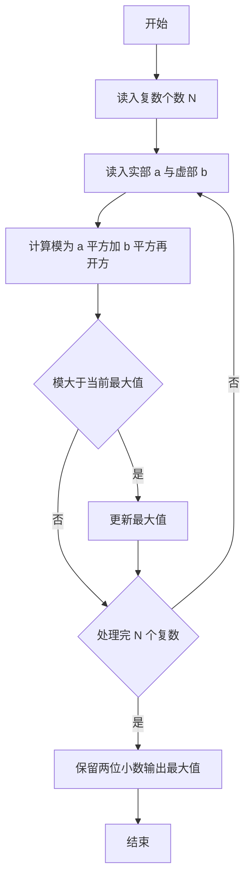
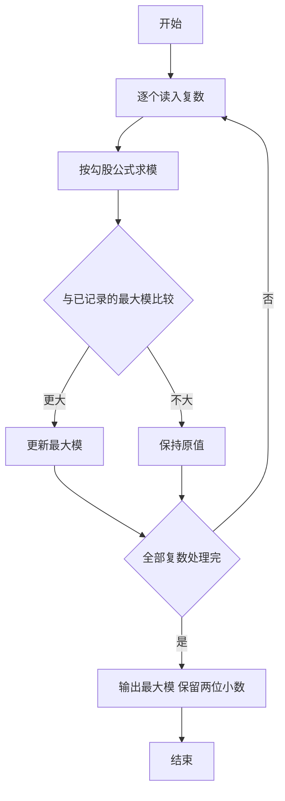

# 1063 计算谱半径 详解

### 解题思路

1. 概念：谱半径定义为所有特征值模的最大值，本题中特征值以复数 `a+bi` 给出，其模为 `sqrt(a² + b²)`，因此问题退化为求一组复数模的最大值。
2. 数据组织：无需存储全部复数，读入一对 `a、b` 立即计算模并与当前最大值 `max_radius` 比较，边读边更新。
3. 关键判断：`radius > max_radius` 时更新最大值；由于模恒为非负，`max_radius` 初始 0 即可正确覆盖全部情况。
4. 计算注意：`a、b` 用 int 读入，`sqrt(a*a + b*b)` 的结果为 double，最终输出保留两位小数。
5. 时间复杂度 O(N)，空间复杂度 O(1)。

### 代码流程说明

1. 读入复数个数 `N`，`max_radius` 初始为 0。
2. 循环 N 次：读入整型实部 `a` 与虚部 `b`，计算 `radius = sqrt(a*a + b*b)`。
3. 若 `radius > max_radius` 则更新 `max_radius`。
4. 输出 `%.2f` 格式的 `max_radius`。

### 代码流程图

### 解题流程图

