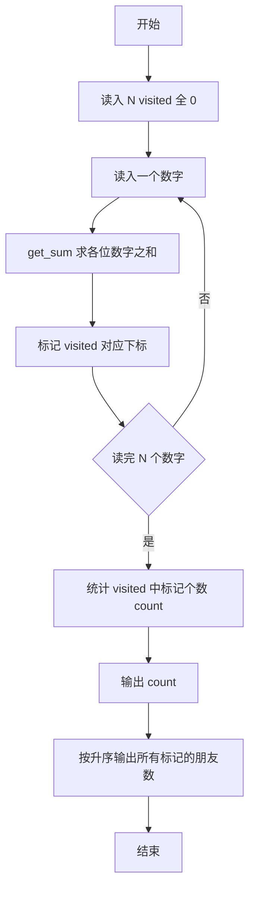
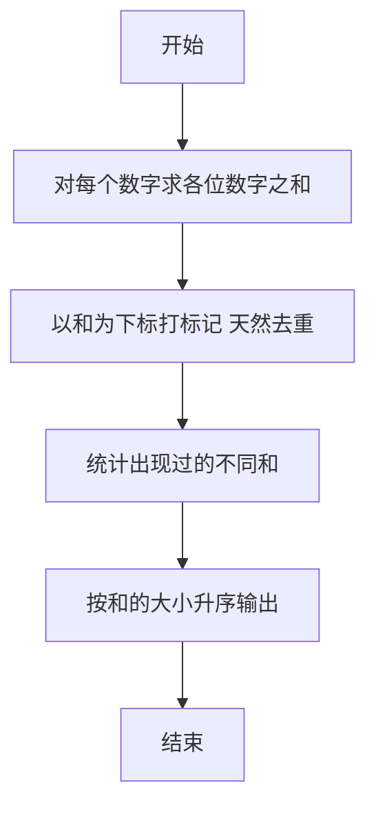

# 1064 朋友数 详解

### 解题思路

1. 核心概念：朋友数即"各位数字之和"，两个数若各位数字之和相等就是朋友数；本题只需统计输入数字中出现了哪些不同的朋友数。
2. 数字拆分：`get_sum` 函数循环取最低位（`num % 10`）累加，再 `num /= 10`，直至数字归零。
3. 数据组织：用数组 `visited` 以"各位数字之和"为下标做标记，出现过的和置 1；题目中数字为正整数，4 位以内最大和为 36，数组开 40 足够。
4. 去重统计：同一种朋友数可能由多个数字产生，`visited` 标记天然去重，最后扫描数组统计标记个数即得朋友数种类数。
5. 输出要求：先输出种类数，再按升序输出各朋友数，第一个前无空格、后续用空格分隔。
6. 时间复杂度 O(N·L)，L 为数字位数。

### 代码流程说明

1. 读入数字个数 `N`，`visited` 数组初始全 0。
2. 循环读入每个数字 `num`，调用 `get_sum(num)` 求其各位数字之和 `sum`，置 `visited[sum] = 1`。
3. 扫描 `visited` 统计置 1 的个数 `count` 并输出。
4. 再扫描一遍 `visited`，用 `first` 标记控制空格，按下标升序输出所有标记为 1 的朋友数，最后换行。

### 代码流程图

### 解题流程图

