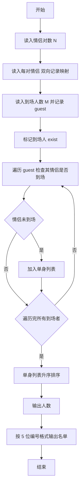
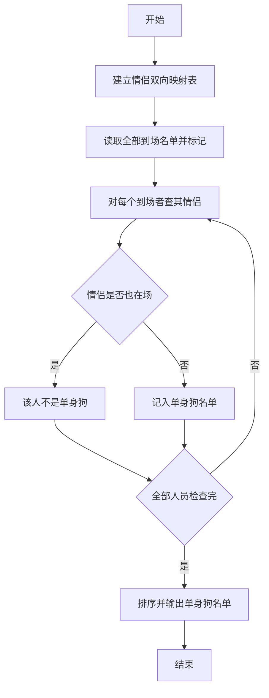

# 1065 单身狗 详解

### 解题思路

1. 数据组织：用数组 `couple` 建立双向情侣映射（`couple[a]=b`、`couple[b]=a`，未登记情人的编号对应 0）；用数组 `exist` 标记编号是否出席派对。
2. 单身狗判定：某人到场，但 `exist[couple[id]] == 0`——即其情人未到场（或此人根本无情侣，`couple[id]` 为 0，也必然判定为单身狗），则加入单身列表。
3. 一次性判断：只需在读完所有到场名单后再统一判定，因为 `exist` 已包含全部到场信息，无需边读边判。
4. 输出处理：单身狗人数可能为 0，此时只输出 `0` 不输出名单；编号用 `%05d` 五位数补零；用 `qsort` 升序排列后空格分隔输出。
5. 时间复杂度 O(M·log M)（排序）。

### 代码流程说明

1. 读入情侣对数 `N`，逐对读入 `a、b`，双向设置 `couple[a]=b`、`couple[b]=a`。
2. 读入到场人数 `M`，把每个人的编号存入 `guest` 数组，并在 `exist` 中标记为 1。
3. 遍历 `guest`：若 `exist[couple[guest[i]]] == 0`，说明其情侣未到场，将该编号存入 `single` 并计数。
4. 对 `single` 升序排序，输出人数，再以 `%05d` 格式空格分隔输出所有单身狗编号（若人数为 0 则不输出名单、不换行）。

### 代码流程图

### 解题流程图

