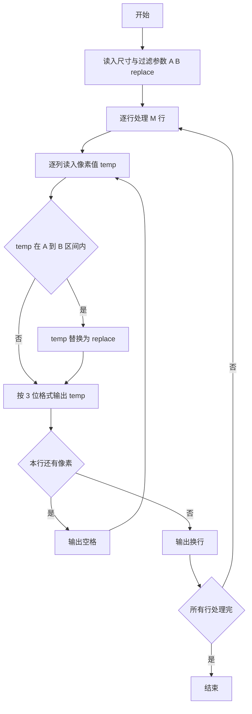
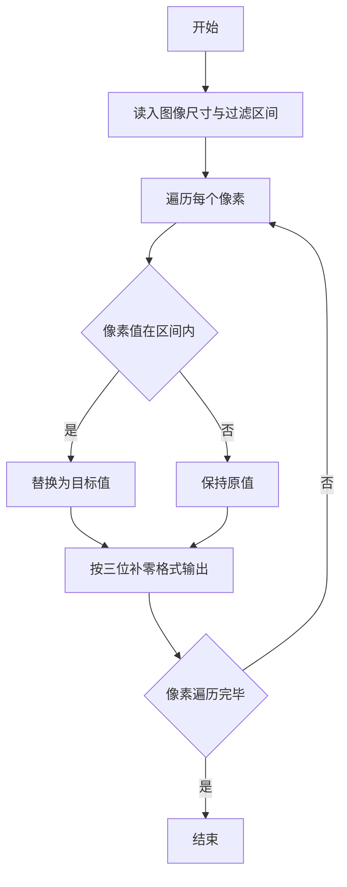

# 1066 图像过滤 详解

### 解题思路

1. 问题本质：对每个像素做一次区间替换，像素值在 [A, B] 内则换成 `replace`，否则保持原值，不需要存储整幅图像，边读边处理即可。
2. 数据组织：仅需尺寸 `M*N`、区间端点 `A、B` 与替换值 `replace`，以及当前读入的临时像素值 `temp`。
3. 关键判断：`temp >= A && temp <= B` 时执行替换（闭区间）。
4. 输出格式：每个像素按 3 位宽度输出，不足补前导 0（`%03d`）；同一行内像素之间用空格分隔，行尾无空格、只换行。
5. 时间复杂度 O(M·N)，空间复杂度 O(1)。

### 代码流程说明

1. 读入尺寸 `M、N` 与过滤参数 `A、B、replace`。
2. 外层循环遍历 M 行，内层循环遍历 N 列：读入像素值 `temp`，若落在 [A, B] 内则令 `temp = replace`。
3. 用 `printf("%03d", temp)` 输出，若 `j < N-1` 输出一个空格。
4. 每行结束后输出换行。

### 代码流程图

### 解题流程图

