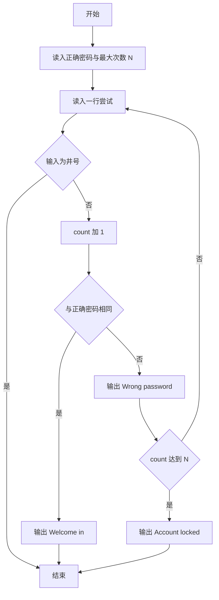
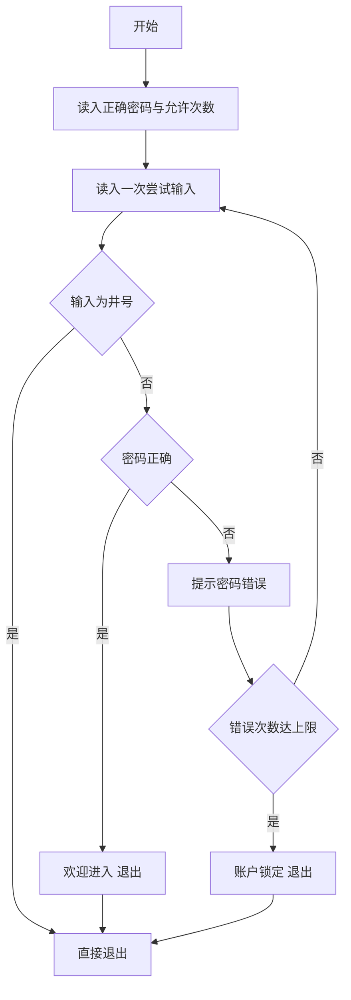

# 1067 试密码 详解

### 解题思路

1. 数据组织：用字符串 `password` 存正确密码、`input` 存每次尝试的输入，`count` 累计已尝试次数，`N` 为最大允许尝试次数。
2. 输入处理技巧：正确密码行后先用 `getchar()` 吃掉换行；每次尝试用 `scanf("%[^\n]")` 读一整行（密码允许含空格），再用 `getchar()` 吃掉行尾换行。
3. 终止条件有四类：输入 `#` 直接结束、密码正确输出 `Welcome in` 结束、错误次数达到上限输出 `Account locked` 结束；其中 `#` 与正确密码的检查都在计数累加之前进行。
4. 关键判断顺序：先判 `#`，再累计 `count` 判正确与否，最后判是否达到次数上限锁定。
5. 边界情况：`N` 表示"最多尝试次数"，达到上限锁定前最后一次错误会先输出 `Wrong password`，再输出 `Account locked`。
6. 时间复杂度 O(K·L)，K 为尝试次数。

### 代码流程说明

1. `scanf` 读入正确密码 `password` 与最大次数 `N`，`getchar()` 清掉行尾换行。
2. 进入 `while(1)` 循环：读入一行尝试 `input` 并吃掉换行。
3. 若 `input` 等于 `#` 则 `break` 直接结束。
4. `count` 加一：若 `strcmp(password, input) == 0` 输出 `Welcome in` 并 `break`；否则输出 `Wrong password: input`，若 `count >= N` 再输出 `Account locked` 并 `break`。
5. 循环条件恒真，靠上述 break 退出程序。

### 代码流程图

### 解题流程图

