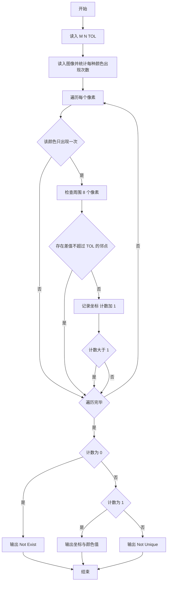
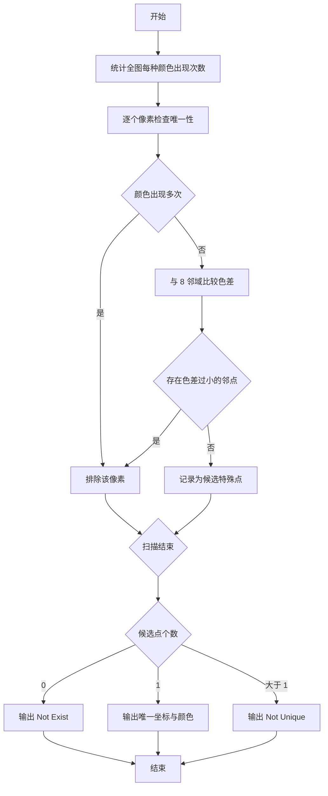

# 1068 万绿丛中一点红 详解

### 解题思路

1. 数据组织：用二维数组 `arr` 存图像，坐标从 1 开始并四周留一圈 0，这样边界像素也能统一按 8 邻域比较，无需单独处理越界；另用 `count_color` 数组统计每种颜色出现的次数。
2. 唯一性判定：只有出现次数恰好为 1 的颜色才可能成为特殊点，先查 `count_color[arr[i][j]] == 1` 快速筛掉重复颜色。
3. 邻域判定：对候选点检查周围 8 个像素，只要存在一个 `abs(差值) <= TOL` 即不满足"与周围颜色差都大于 TOL"。
4. 提前终止：找到第二个符合条件的点时 `cnt > 1`，立即跳出双层循环，输出 `Not Unique`，无需继续扫描。
5. 颜色计数数组的大小按题目颜色取值范围开足够大（17000000），且颜色可能为负、可能超出普通数组下标范围，用数组下标直接统计。
6. 时间复杂度 O(N·M·8)。

### 代码流程说明

1. 读入宽 `M`、高 `N`、阈值 `TOL`；`arr` 与 `count_color` 初始为 0。
2. 双层循环读入每个像素存入 `arr[i][j]`（i、j 从 1 开始），同时 `count_color[arr[i][j]]++`。
3. 再次双层遍历：若 `count_color[arr[i][j]] != 1` 跳过；否则用 `flag` 初始为 1，遍历 `dx、dy` 从 -1 到 1（跳过自身），一旦 `abs(arr[i][j] - arr[i+dx][j+dy]) <= TOL` 置 `flag = 0`。
4. 若 `flag` 仍为 1：记录坐标 `x = j`、`y = i`，`cnt` 加一，`cnt > 1` 时跳出循环。
5. 按 `cnt` 分三种情况输出：0 输出 `Not Exist`，1 输出 `(x, y): 颜色值`，大于 1 输出 `Not Unique`。

### 代码流程图

### 解题流程图

