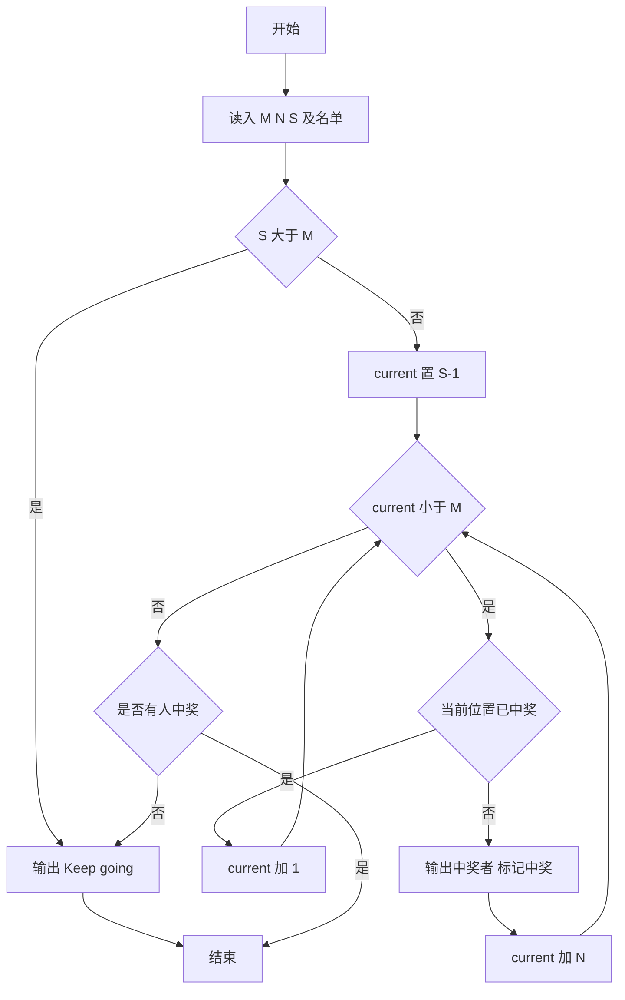
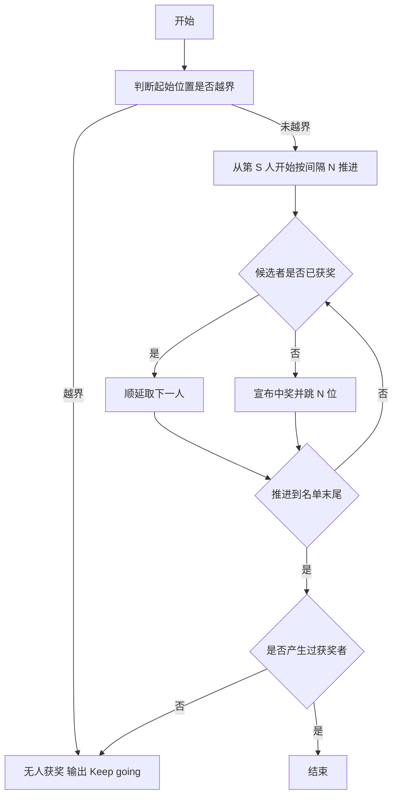

# 1069 微博转发抽奖 详解

### 解题思路

1. 规则要点：从第 `S` 位转发者开始，每隔 `N` 位抽取一人；若抽中者已获奖，则顺延取下一位（`current++`），保证不重复获奖。
2. 数据组织：`names` 二维数组按下标存转发名单（读入顺序即转发顺序），`won` 数组标记对应下标是否已中奖。
3. 提前剪枝：若起始位置 `S > M`，没有任何人可获奖，直接输出 `Keep going...` 结束。
4. 主循环策略：`current` 从 `S-1`（转 0 起始下标）开始，若该位置未中奖则输出并跳 `current += N`；若已中奖则只后移一位 `current++`，即"跳过重复者继续寻找"。
5. 兜底判断：循环自然结束后若无任何获奖者（例如起始位置之后无人），输出 `Keep going...`。
6. 时间复杂度 O(M)，每个下标至多访问两次。

### 代码流程说明

1. 读入转发人数 `M`、间隔 `N`、起始位置 `S`，再读入全部昵称存入 `names`。
2. 若 `S > M` 输出 `Keep going...` 并直接返回。
3. `current = S - 1`、`has_won = 0`，进入 `while (current < M)` 循环：
   - 若 `won[current] == 0`：输出 `names[current]`，标记中奖，`has_won = 1`，`current += N`；
   - 否则 `current++` 顺延一位。
4. 循环结束后若 `has_won` 为 0，输出 `Keep going...`。

### 代码流程图

### 解题流程图

