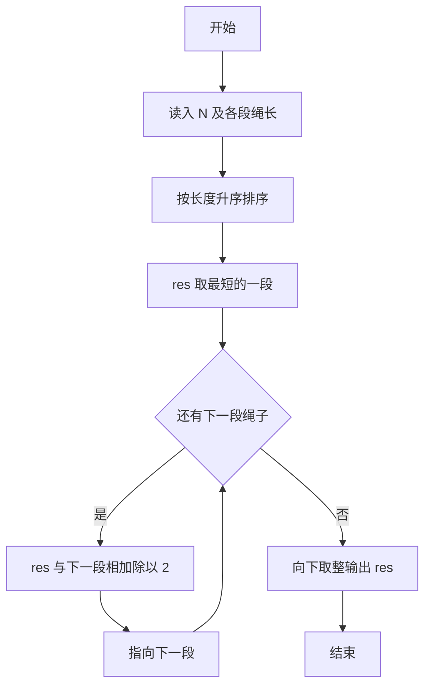
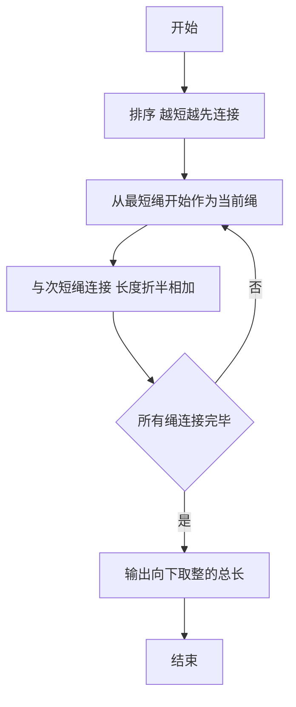

# 1070 结绳 详解

### 解题思路

1. 贪心策略：每连接两条绳子，新长度为两者长度之和的一半，每次连接都会"损失"一半长度，因此应尽量让短的绳子少被折半、长的绳子后参与连接，即每次都连接当前最短的两条。
2. 实现方式：把所有绳长升序排序，从最短的一段开始，依次与下一段做 `(current + rope[i]) / 2`，等价于不断把当前绳与剩余最短绳相接。
3. 数学性质：排序后从小到大依次合并，恰好保证最短的绳子被折半次数最多、最长的被折半次数最少，总长度达到最大。
4. 数值处理：中间过程用 double 保存 `res`，避免整数除法截断，最后按题意向下取整输出 `(int)res`。
5. 时间复杂度 O(N log N)（排序）。

### 代码流程说明

1. 读入绳段数 `N` 及各段长度存入 `rope`。
2. 调用 `qsort` 按 `cmp` 升序排序。
3. `res` 初始为最短的一段 `rope[0]`，循环 `i` 从 1 到 N-1：`res = (res + rope[i]) / 2`。
4. 输出 `(int)res`（向下取整）。

### 代码流程图

### 解题流程图

