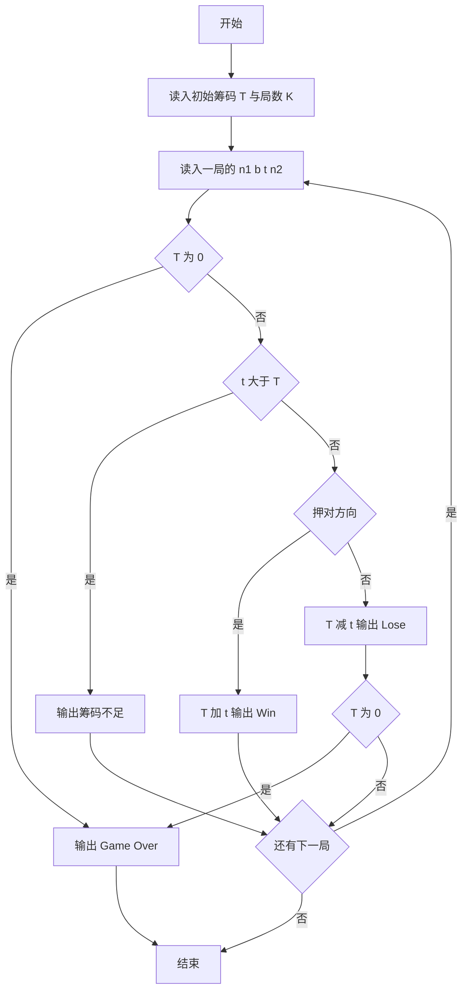
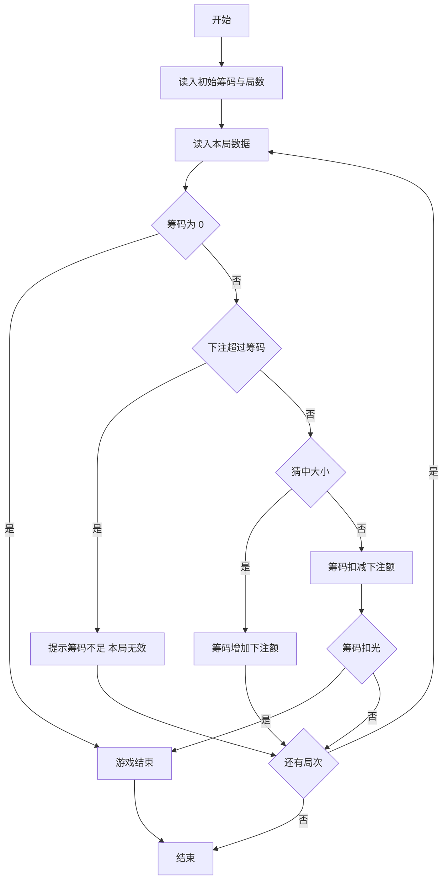

# 1071 小赌怡情 详解

### 解题思路

1. 游戏规则：每局给出两数 `n1、n2`，`b = 0` 表示押小（猜 `n1 > n2`），`b = 1` 表示押大（猜 `n1 < n2`），`t` 为下注筹码，猜中得 `t`、猜错输 `t`。
2. 状态维护：全局只需两个变量——当前筹码 `T` 与总局数 `K`；每局处理完即时输出并更新 `T`。
3. 关键判断一（下注上限）：`t > T` 时筹码不足，输出 `Not enough tokens` 并跳过本局（`continue`，不扣筹码）。
4. 关键判断二（输赢）：`(n1 > n2 && b == 0) || (n1 < n2 && b == 1)` 为赢，否则为输。
5. 关键判断三（游戏结束）：局首若 `T == 0` 输出 `Game Over.` 并退出；局尾输光筹码同样输出 `Game Over.` 退出。
6. 注意 `n1 == n2` 时既不是押大也不是押小，按输处理。
7. 时间复杂度 O(K)。

### 代码流程说明

1. 读入初始筹码 `T` 与游戏次数 `K`。
2. 循环 K 局：读入 `n1、b、t、n2`。
3. 若 `T == 0`：输出 `Game Over.` 并 `break`。
4. 若 `t > T`：输出 `Not enough tokens. Total = T.` 并 `continue` 本局。
5. 判断输赢：赢则 `T += t` 输出 `Win` 信息；输则 `T -= t` 输出 `Lose` 信息，若 `T` 归零再输出 `Game Over.` 并 `break`。

### 代码流程图

### 解题流程图

