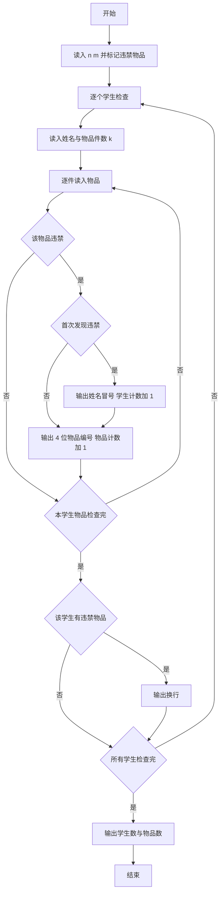
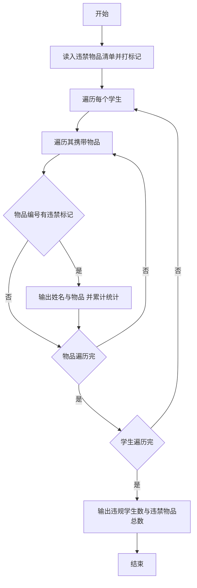

# 1072 开学寄语 详解

### 解题思路

1. 数据组织：用数组 `banned` 以物品编号为下标做标记（置 1 表示违禁），查询时 O(1) 判断某物品是否违禁。
2. 逐学生检查：每个学生读入姓名与携带物品数 `k`，逐个物品判断是否在违禁表中，发现违禁物品才打印输出。
3. 输出格式控制：用 `first` 标记保证只在该学生第一条违禁物品前输出 `姓名:`，违禁物品以 4 位编号（`%04d`）空格分隔；该学生无违禁物品则不输出任何内容；有违禁物品的整行以换行结尾。
4. 统计变量：`student_count` 记携带违禁物品的学生数，`goods_count` 记违禁物品总件数，均只在发现违禁时累加。
5. 时间复杂度 O(n·k)。

### 代码流程说明

1. 读入学生数 `n` 与违禁物品类别数 `m`，`banned` 数组初始全 0。
2. 循环读入 `m` 个违禁物品编号 `id`，置 `banned[id] = 1`。
3. 循环处理每个学生：读入姓名 `name` 与携带件数 `k`，初始化 `first = 1`、`has_banned = 0`。
4. 内层循环读入每件物品 `item`：若 `banned[item]` 为真，则首次发现时先输出 `姓名:` 并计数 `student_count++`，随后输出 ` %04d`，`goods_count++`。
5. 若该学生有违禁物品，输出换行；所有学生处理完后输出 `student_count` 与 `goods_count`。

### 代码流程图

### 解题流程图

