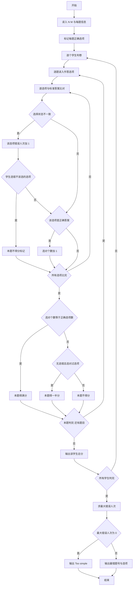
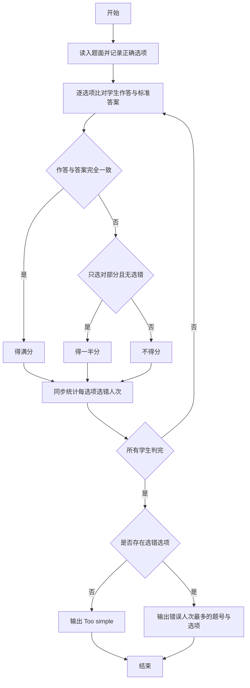

# 1073 多选题常见计分法 详解

### 解题思路

1. 计分规则：作答与标准答案逐选项比对——完全正确得满分；只选对了部分正确选项且没有选任何错误选项得一半分；一旦选了错误选项本题不得分。
2. 数据组织：`score`（分值）、`opt_num`（选项数）、`ans_num`（正确选项数）三个数组存题面信息；`ans[i][k]` 标记第 i 题选项 k 是否正确答案；`wrong[i][k]` 统计第 i 题选项 k 被"选错"的人次。
3. 错误统计口径：只要学生该选项的选择状态与标准答案不一致就计一次错误（`wrong[j][k]++`），包括"该选未选"与"不该选却选"两种情况，用于统计常见错误选项。
4. 得分判定：用 `flag` 记录选对的正确选项个数，`partial` 记录是否只选了正确选项的子集（选了错误选项则置 0）；`flag == ans_num` 得满分，否则 `partial && flag > 0` 得半分。
5. 最错选项输出：求所有 `wrong` 的最大值，为 0 输出 `Too simple`，否则按题号、选项字母顺序输出所有达到最大值的 `题号-选项`。
6. 输入解析：逐题作答形如 `(n 选项...)`，用 `scanf("(%d", &cnt)` 读左括号与个数、`scanf(")")` 读右括号，选项字母转下标 `c - 'a'`。
7. 时间复杂度 O(N·M·选项数)。

### 代码流程说明

1. 读入学生数 `N` 与题目数 `M`，`wrong` 数组全 0。
2. 逐题读入分值、选项数、正确选项数，再循环读入每个正确选项字母并置 `ans[i][c-'a'] = 1`。
3. 逐个学生判卷：`total` 初始为 0，`getchar()` 吃掉行首换行；逐题读入作答：`scanf("(%d", &cnt)` 后读入各选项字母置 `stu_ans` 标记，再 `scanf(")")`。
4. 逐选项比对：不一致则 `wrong[j][k]++` 且若学生多选了错误选项则 `partial = 0`；一致且是正确选项则 `flag++`。
5. 按 `flag` 与 `partial` 给本题加分（满分或半分），该学生全部题目判完后输出总分（保留一位小数）。
6. 统计 `max_wrong`：为 0 输出 `Too simple`，否则遍历输出 `max_wrong 题号-选项`。

### 代码流程图

### 解题流程图

