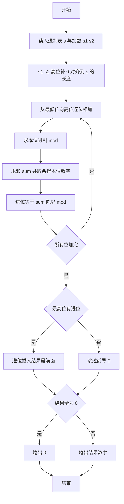
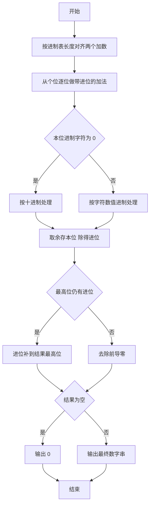

# 1074 宇宙无敌加法器 详解

### 解题思路

1. 问题本质：对两个大整数按"位进制表"做逐位加法，每一位的进制由字符串 `s` 中对应字符给出，`s[i] = '0'` 表示该位为十进制，否则为 `s[i]-'0'` 进制。
2. 对齐处理：把两个加数 `s1、s2` 在高位补字符 `'0'`，使二者与进制表 `s` 等长（`len`），之后从最低位（下标 len-1）向最高位逐位相加。
3. 逐位运算：当前位之和 `sum = 本位数 + 本位数 + 进位`，本位的最终数字为 `sum % mod`，向高位的进位为 `sum / mod`，其中 `mod` 为本位进制（'0' 时取 10）。
4. 输出处理：若最高位仍有进位，把进位数字插入结果最前面（整体后移一位）；否则跳过前导 0；若结果全为 0 则只输出一个 `0`。
5. 加法器长度以 `s` 的长度为基准，结果最大为 len+1 位（含额外进位），`ans` 数组预留 22 位足够。
6. 时间复杂度 O(len)。

### 代码流程说明

1. 依次读入进制表 `s`、加数 `s1`、加数 `s2`，`len = strlen(s)`。
2. 分别把 `s1、s2` 从各自末尾补 `'0'` 到第 len 位并加 `\0` 结尾，完成高位对齐。
3. `carry = 0`，从 `i = len-1` 递减到 0：`mod = s[i]=='0' ? 10 : s[i]-'0'`；`sum = (s1[i]-'0') + (s2[i]-'0') + carry`；`ans[i] = sum % mod + '0'`；`carry = sum / mod`。
4. 若 `carry` 非 0：把 `carry` 写到 `ans[0]`，原结果整体后移一位，长度 `len` 加 1；否则 `start` 从 0 开始跳过前导 0。
5. 若跳过前导 0 后 `start == len` 输出 `0`；否则从 `start` 到 `len-1` 逐字符输出结果，末尾换行。

### 代码流程图

### 解题流程图

