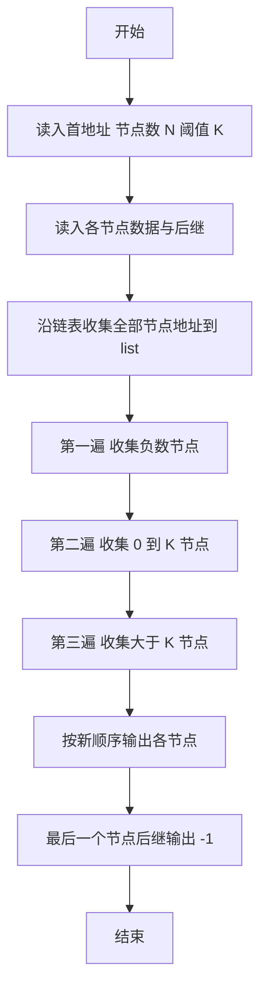
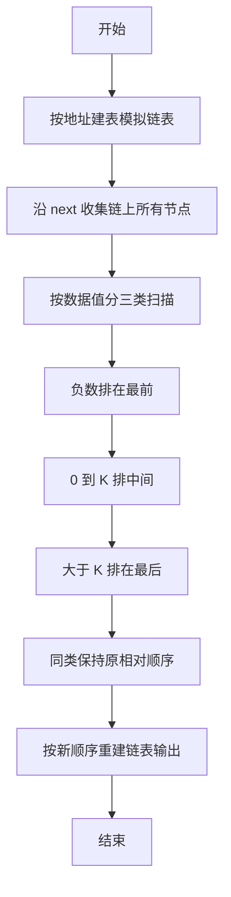

# 1075 链表元素分类 详解

### 解题思路

1. 数据组织：用结构体数组 `nodes` 以"地址"为下标模拟链表（`nodes[addr].data` 存值、`nodes[addr].next` 存后继地址），地址范围小可直接做数组下标。
2. 链式遍历：从首地址 `first` 出发，沿 `next` 把整条链表上所有节点的地址按原顺序收集到 `list` 数组（注意输入中可能有不在链上的节点，需以 -1 结束为准）。
3. 稳定重排：分三次顺序扫描 `list`，依次把"负数"、"0 到 K 之间的数"、"大于 K 的数"三类节点地址先后追加到 `result`，不改变同类节点内部相对顺序（稳定性），即题目要求的排序规则。
4. 关键判断：`data < 0`、`0 <= data <= K`、`data > K` 三个区间互斥且覆盖全部。
5. 输出重建：`result` 中相邻两个地址构成新链表的前后关系，每个节点输出 `地址 值 下一地址`，末节点后继输出 `-1`，地址均以 `%05d` 补零。
6. 时间复杂度 O(N)（三次扫描），空间 O(N)。

### 代码流程说明

1. 读入首地址 `first`、节点数 `N`、分类阈值 `K`；循环读入每个节点的地址、值、后继存入 `nodes`。
2. 从 `p = first` 开始沿 `nodes[p].next` 遍历，把沿途地址依次存入 `list`，直到 `p == -1`，得到实际链上节点数 `count`。
3. 三次遍历 `list`：第一次收集值小于 0 的节点地址，第二次收集值在 [0, K] 的节点地址，第三次收集值大于 K 的节点地址，依次写入 `result`。
4. 输出 `idx` 个节点：前 `idx-1` 个以 `result[i]` 为当前地址、`result[i+1]` 为后继；最后一个输出后继 `-1`。

### 代码流程图

### 解题流程图

