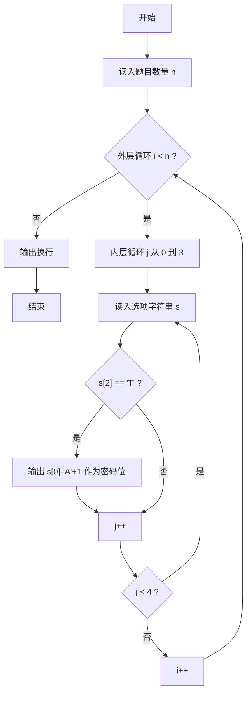
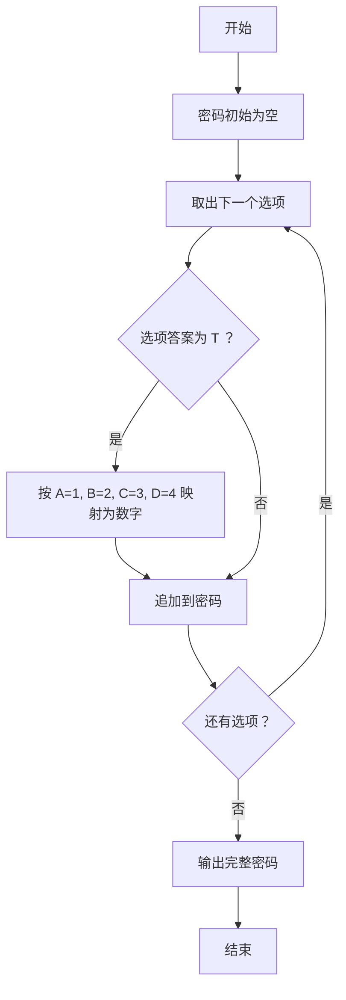

# 1076 Wifi密码 详解

### 解题思路
- 题目把 WiFi 密码隐藏在选择题的答案选项中：每道选择题有 4 个选项，每个选项是一个形如 "选项字母-答案" 的字符串（如 `A-T`、`B-F`）。
- 关键判断：每个选项字符串的第三个字符（下标 2）是 `T` 还是 `F`。若为 `T`，说明该选项是正确答案，该选项对应的字母即密码的一位。
- 字母与数字的映射规则固定：`A->1, B->2, C->3, D->4`，可通过 `选项字母 - 'A' + 1` 直接计算，无需查表。
- 数据组织：无需数组存储，逐条读取选项字符串，边读边输出密码位即可。
- 时间复杂度：O(n)（共 4n 个选项，每个选项只扫描 1 次）。

### 代码流程说明
- 先用 `scanf` 读入题目数量 `n`。
- 外层循环 `i` 从 0 到 n-1，内层循环 `j` 从 0 到 3，共处理 4n 个选项。
- 每次用 `scanf("%s", s)` 读入一个选项字符串（如 `A-T`），判断 `s[2] == 'T'`。
- 若成立，用 `printf("%d", s[0] - 'A' + 1)` 输出对应密码位，数字之间不换行。
- 全部处理完后补一个 `printf("\n")` 换行，程序结束。

### 代码流程图

### 解题流程图

