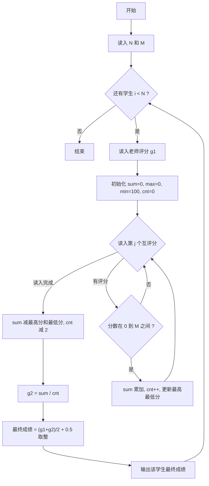
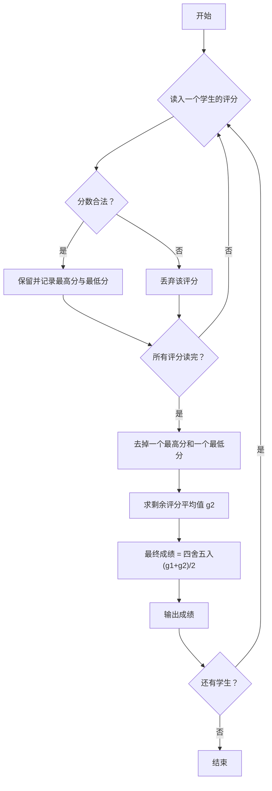

# 1077 互评成绩计算 详解

### 解题思路
- 每个学生除老师评分 `g1` 外，还会收到其他 N-1 名学生的互评分。
- 先过滤非法评分：只统计落在 `[0, M]` 区间内的评分，区间外的评分直接忽略，不参与计数与求和。
- 去掉一个最高分和一个最低分（`sum -= max + min`，`cnt -= 2`），用剩余评分求平均得到 `g2`。
- 最终成绩 = `(g1 + g2) / 2`，四舍五入取整——代码通过 `+ 0.5` 后取整实现（利用整数截断模拟四舍五入）。
- 边界说明：`max_score` 初始为 0、`min_score` 初始为 100，保证至少两个合法评分时才能正确更新。
- 时间复杂度：O(N) 处理一个学生，总复杂度 O(N²)，N 较小可直接双重循环。

### 代码流程说明
- 读入学生人数 `N` 和满分 `M`。
- 外层循环对每个学生：先读入老师评分 `g1`，再内层循环读入 N-1 个互评分。
- 内层循环中，合法评分累加到 `sum`、计数 `cnt++`，并同步更新 `max_score` 与 `min_score`。
- 循环结束后减去最高最低分、计数减 2，计算平均分 `g2 = sum * 1.0 / cnt`。
- 计算 `final_score = (g1 + g2) / 2 + 0.5` 取整输出，进入下一个学生。

### 代码流程图

### 解题流程图

