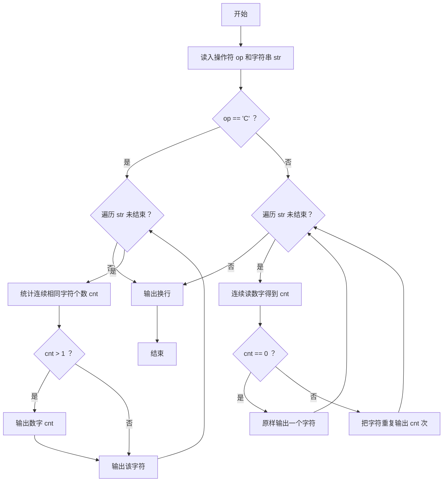
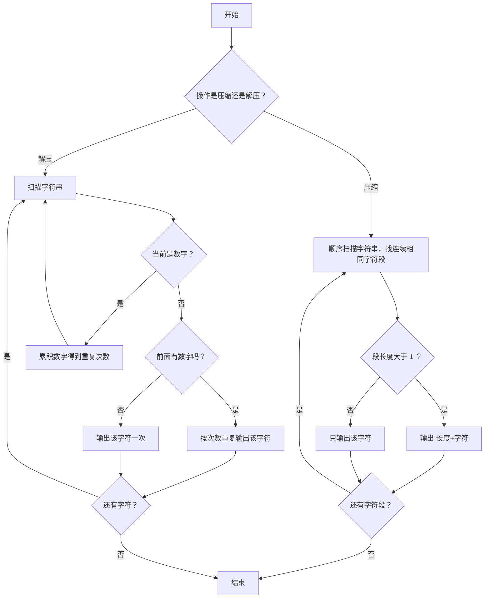

# 1078 字符串压缩与解压 详解

### 解题思路
- 根据首字符 `C`（压缩）或 `D`（解压）选择不同处理分支，首字符后为待处理字符串。
- 压缩：从左到右扫描，用内部 while 统计连续相同字符个数 `cnt`；`cnt > 1` 时先输出数字再输出字符，`cnt == 1` 时只输出字符本身。
- 解压：扫描字符串，遇到数字时用 `cnt = cnt * 10 + digit` 累积出多位数；遇到非数字字符时，若前面有数字则按次数重复输出该字符，无数字则原样输出一次。
- 关键细节：压缩时数字 1 省略不写，因此解压时无数字前缀的字符恰好对应"出现 1 次"，两种处理天然互补。
- 时间复杂度：压缩与解压均为 O(len)，单次线性扫描即可完成。

### 代码流程说明
- 读入操作符 `op`，用 `getchar()` 吃掉换行符，再用 `gets(str)` 读入整行字符串。
- 若 `op == 'C'`：外层 for 遍历字符串，内层 while 统计连续相同字符个数；`cnt > 1` 时先 `printf` 数字，再输出该字符（跳过已统计的重复字符靠 `i++` 实现）。
- 若 `op == 'D'`：for 遍历时先用 while 连续读数字累加得到 `cnt`，若 `cnt == 0` 原样输出单个字符，否则用内层 for 循环把该字符重复输出 `cnt` 次。
- 最后统一输出换行。

### 代码流程图

### 解题流程图

