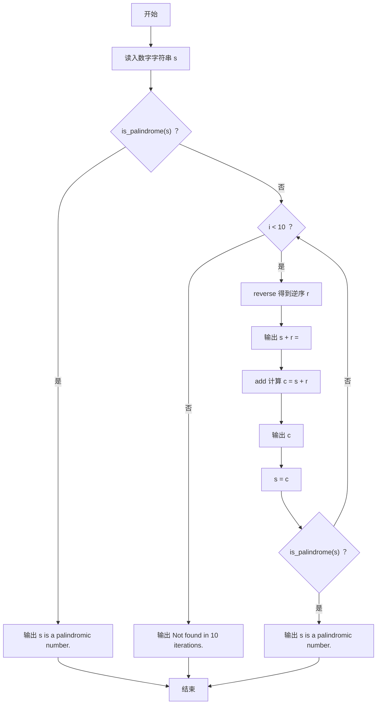
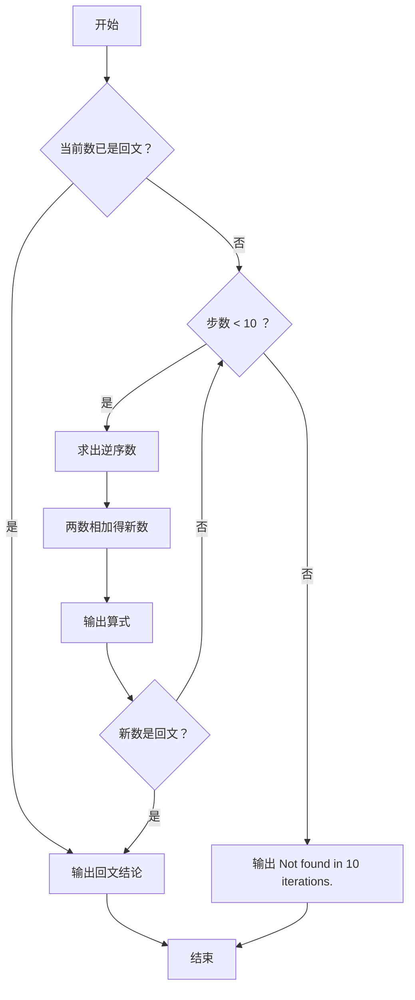

# 1079 延迟的回文数 详解

### 解题思路
- 回文数判断：`is_palindrome` 函数只比较字符串前半段与后半段的对称位置，发现任何一处不等即返回 0，复杂度 O(len)。
- 逆序：`reverse` 函数把原串按相反顺序拷贝到目标串，末尾补 `'\0'`。
- 大数相加：`add` 函数按字符串逐位相加，从低位（字符串末尾）向高位进位，结果先逆序存入 `c`，最后整体翻转回正序——因为题目保证两数等长，所以可以假定 `a`、`b` 长度一致。
- 主逻辑：最多迭代 10 次，每次输出 "原数 + 逆序 = 和" 的算式，再用结果替换当前数；中途一旦出现回文数立即输出结论并退出。
- 10 次仍无回文数则输出 `Not found in 10 iterations.`。
- 输入本身是回文数时直接输出结论，不再迭代。
- 时间复杂度：每次迭代 O(L)（L 为当前数字长度），总长度最多 1000 左右，10 次迭代开销极小。

### 代码流程说明
- 定义辅助函数 `is_palindrome`、`reverse`、`add`，其中 `add` 内先逐位累加并处理进位，再翻转结果字符串。
- `main` 中读入初始数字 `s`；若 `is_palindrome(s)` 为真，输出 "s is a palindromic number." 并结束。
- 否则进入 10 次循环：`reverse` 生成 `r`，打印算式，`add(s, r, c)` 得到和，打印 `c` 并把 `c` 拷贝回 `s`；随后检查新 `s` 是否为回文，是则输出结论并结束。
- 循环自然结束（10 次均失败）后输出 `Not found in 10 iterations.`。

### 代码流程图

### 解题流程图

