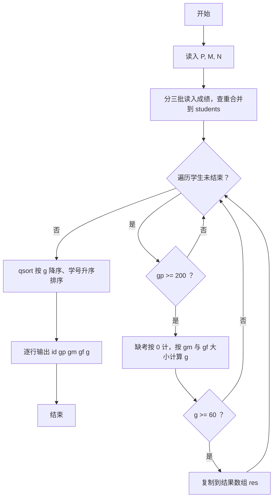
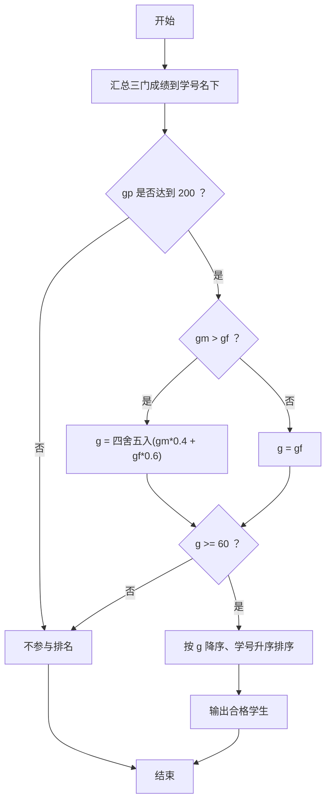

# 1080 MOOC期终成绩 详解

### 解题思路
- 数据组织：用 `struct Student` 保存学号及三门成绩，缺考成绩记为 `-1`；用数组 `students` 按"先查重再插入"的方式合并三批输入（编程作业 P、期中 M、期终 N）。
- 合并技巧：读入每条记录时线性扫描已有学生，学号已存在则更新对应字段，否则新增学生并把其余两门成绩置 `-1`。
- 筛选规则：`gp >= 200` 才有资格参评；缺考成绩按 0 处理；若 `gm > gf` 则 `g = gm*0.4 + gf*0.6` 四舍五入，否则 `g = gf`；最终 `g >= 60` 才进入输出列表。
- 四舍五入：`(int)(加权值 + 0.5)` 利用整数截断实现。
- 排序：`qsort` 按 `g` 降序、`g` 相同按学号字典序升序。
- 时间复杂度：合并三批输入每次线性查重，最坏 O((P+M+N)×人数)，人数上限 3 万，可接受。

### 代码流程说明
- 读入 P、M、N 三个条数；定义 `students` 数组与计数器 `count`。
- 三段几乎相同的读入循环（P、M、N）：读学号和成绩，线性查找学号，存在则更新，不存在则新增并初始化其余成绩为 `-1`。
- 遍历 `students`：`gp < 200` 跳过；把 `-1` 的成绩当作 0，按 `gm > gf` 与否计算 `g`；`g >= 60` 的复制到结果数组 `res`。
- 用 `qsort` 对 `res` 排序（比较函数 `cmp` 先比 `g` 降序再比学号升序）。
- 逐行输出 `id gp gm gf g`。

### 代码流程图

### 解题流程图

