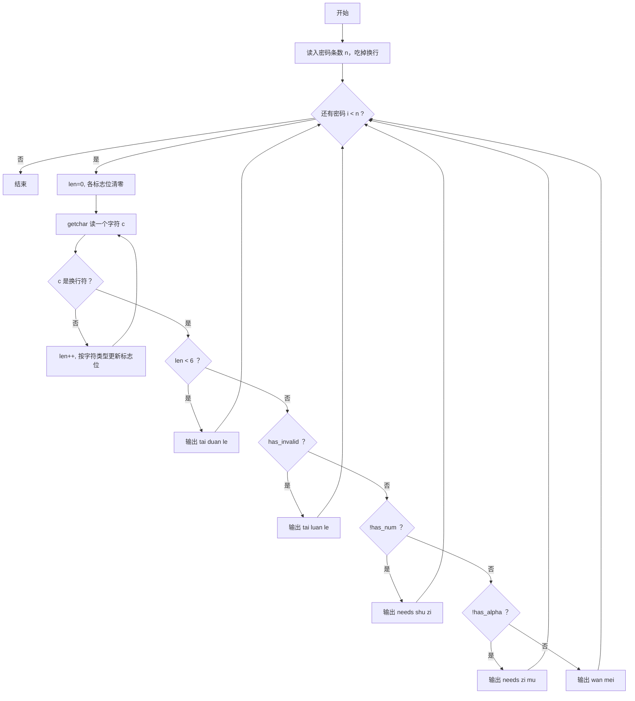
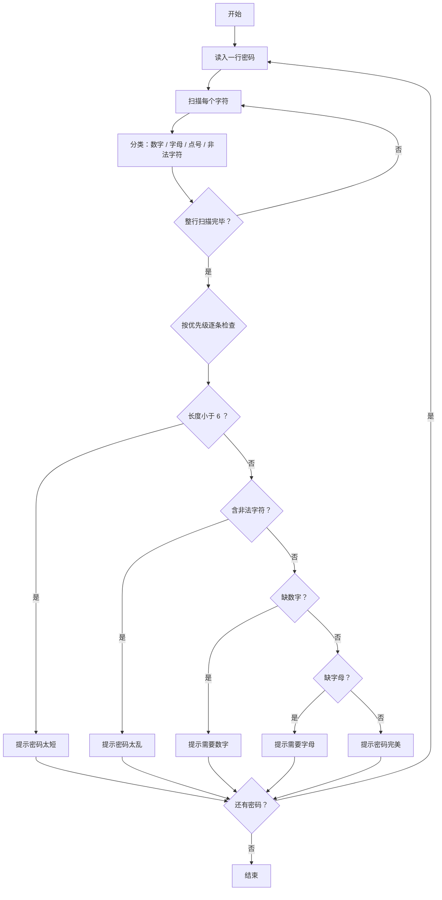

# 1081 检查密码 详解

### 解题思路
- 逐字符读入一行密码（密码可能含空格，因此用 `getchar()` 逐个字符读到 `'\n'` 为止，而不能用 `scanf`）。
- 边读边统计四个指标：长度 `len`、是否有数字 `has_num`、是否有字母 `has_alpha`、是否含非法字符 `has_invalid`。
- 合法字符只有三类：数字（`isdigit`）、字母（`isalpha`）、点号 `.`；其余字符一律算非法。
- 判定按优先级顺序输出，只有前一条不满足才检查下一条：长度不足 6 → 含非法字符 → 缺数字 → 缺字母 → 全部满足。
- 细节：`scanf("%d", &n)` 后必须 `getchar()` 吃掉行尾换行，否则会被当成第一条密码。
- 时间复杂度：O(L)（L 为密码总长度）。

### 代码流程说明
- 读入密码条数 `n` 并 `getchar()` 清掉换行符。
- 外层循环 n 次：初始化 `len`、`has_num`、`has_alpha`、`has_invalid` 为 0。
- 内层 while 用 `getchar()` 逐个读字符直到换行：长度加 1，按 `isdigit` / `isalpha` / 是否为 `'.'` 更新对应标志。
- 按优先级 `if-else if` 链判断并输出对应英文提示，然后进入下一条密码。

### 代码流程图

### 解题流程图

