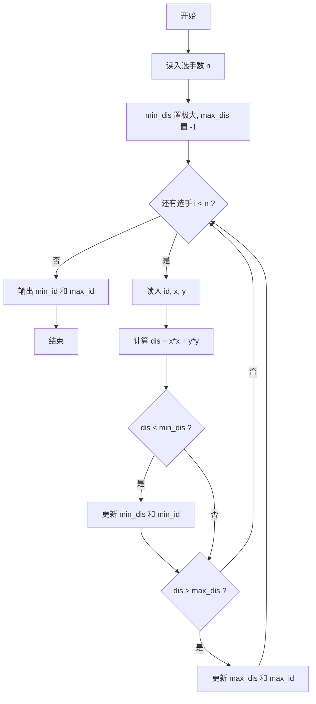
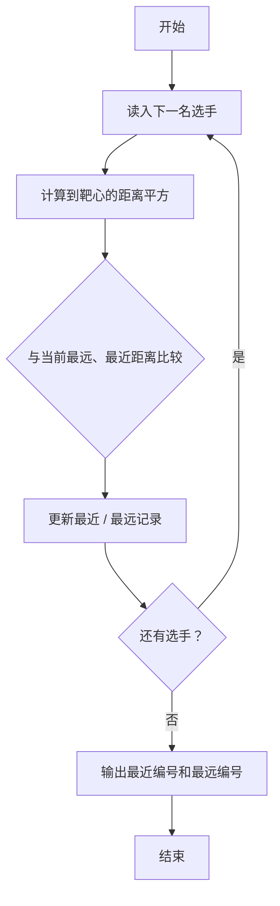

# 1082 射击比赛 详解

### 解题思路
- 靶心位于原点 (0,0)，选手成绩按其射击坐标与原点距离排序，找最近和最远的选手。
- 距离比较用平方 `x*x + y*y` 代替开方，避免浮点运算，比较结果与真实距离一致。
- 数据组织：只需两个变量 `min_dis`、`max_dis` 记录极值，两个字符数组 `min_id`、`max_id` 保存对应编号，无需存全部数据。
- 初值设置：`min_dis` 取极大值（1000000），`max_dis` 取 `-1`，保证第一条记录必然更新两者。
- 编号长度为 4 个字符，更新极值时逐字符拷贝（`for j<4`）实现，注意拷贝后 `min_id`、`max_id` 仍是完整的 4 位编号。
- 时间复杂度：O(n)，单次扫描即可。

### 代码流程说明
- 读入选手数量 `n`，初始化 `min_dis = 1000000`、`max_dis = -1`。
- 循环 n 次：读入编号 `id` 与坐标 `x, y`；计算 `dis = x*x + y*y`。
- `dis < min_dis` 时更新最小距离并逐字符把编号拷入 `min_id`；`dis > max_dis` 时同理更新 `max_id`。
- 循环结束后 `printf("%s %s", min_id, max_id)` 先输出最近者再输出最远者。

### 代码流程图

### 解题流程图

