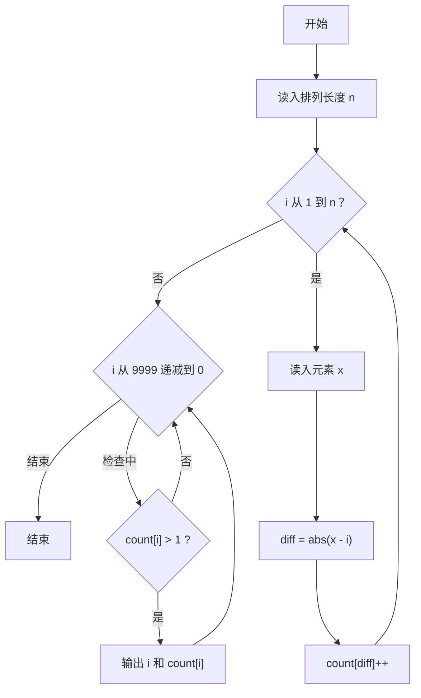
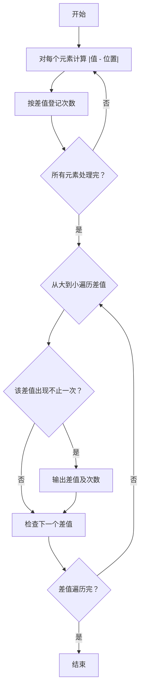

# 1083 是否存在相等的差 详解

### 解题思路
- 给定一个 1~N 的排列，对每个元素计算其与所在位置（从 1 开始编号）的差的绝对值，即 `diff = |x - i|`。
- 数据组织：用计数数组 `count[10000]` 记录每个差值出现的次数，用"差值"作下标，直接完成统计，无需排序。
- 由于是排列，差值范围不会超过 N（最大 10000），数组大小足够。
- 输出规则：只输出出现次数大于 1 的差值，且按差值从大到小输出。
- 时间复杂度：读入 O(N)，输出 O(10000)，总体线性。

### 代码流程说明
- 读入排列长度 `n`，初始化 `count` 数组全 0。
- 循环 `i` 从 1 到 n：读入元素值 `x`，用 `abs(x - i)` 计算差值 `diff`，执行 `count[diff]++`。
- 从 `i = 9999` 递减到 0，凡是 `count[i] > 1` 的差值，输出 "i 次数"。

### 代码流程图

### 解题流程图

