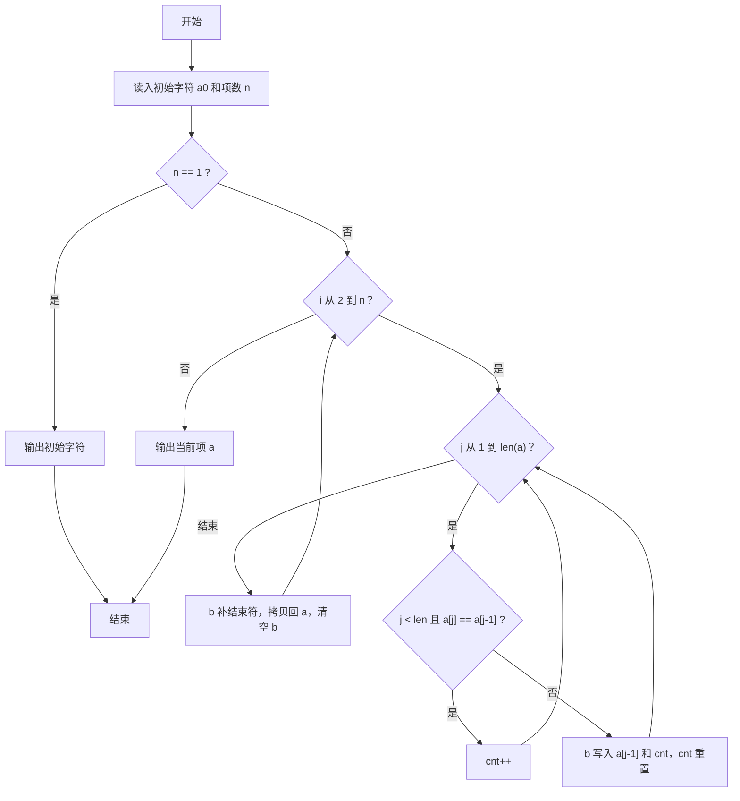
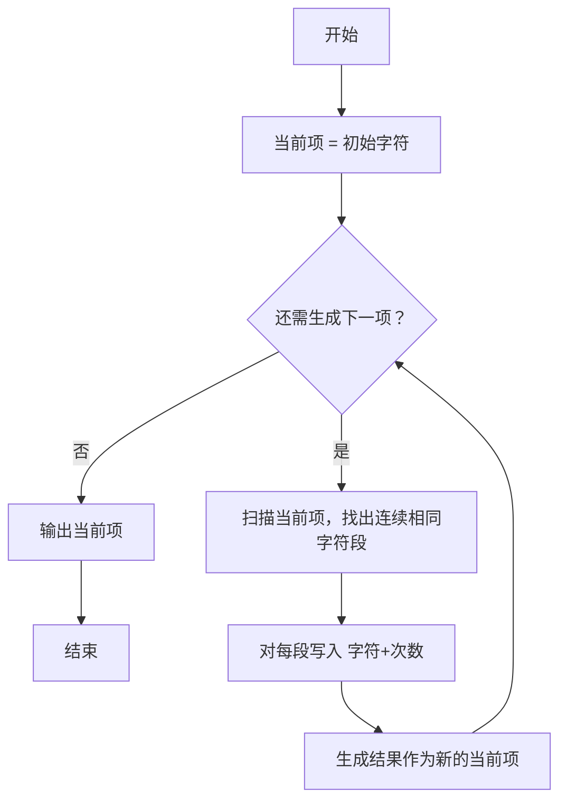

# 1084 外观数列 详解

### 解题思路
- 外观数列第 n 项是"描述第 n-1 项外观"的字符串：从左到右把每个连续相同字符段写成"字符+出现次数"。
- 例：第 1 项为 `1`，第 2 项为 `11`（一个 1），第 3 项为 `21`（两个 1）……
- 数据组织：两个大字符数组 `a`（当前项）与 `b`（下一项），每次用 `b` 生成下一项后拷回 `a` 并清空 `b`。
- 生成算法：遍历当前串，若当前字符与前一字符相同则计数 `cnt++`，否则把"前一个字符 + 次数"写入 `b` 并重置计数。
- 实现细节：循环 `j` 从 1 到 `len`（含 `j == len` 的哨兵边界），利用 `j == len` 触发最后一段的收尾写出。
- 时间复杂度：第 n 项长度指数增长，设第 n 项长度为 L，则总体 O(L)，数组开 10^5 足够。

### 代码流程说明
- 用 `scanf("%c %d", &a[0], &n)` 读入初始字符和项数 n。
- 若 `n == 1` 直接输出 `a[0]` 结束。
- 外层循环 `i` 从 2 到 n：取 `len = strlen(a)`，初始化计数 `cnt = 1`、写入位置 `idx = 0`。
- 内层循环 `j` 从 1 到 len：`j < len` 且与前一字符相同则 `cnt++`；否则把 `a[j-1]` 和 `cnt + '0'` 依次写入 `b`，`cnt` 重置为 1。
- 循环结束给 `b` 补 `'\0'`，`strcpy(a, b)` 作为新的当前项，再 `memset` 清空 `b`。
- 外层循环结束后输出 `a`。

### 代码流程图

### 解题流程图

