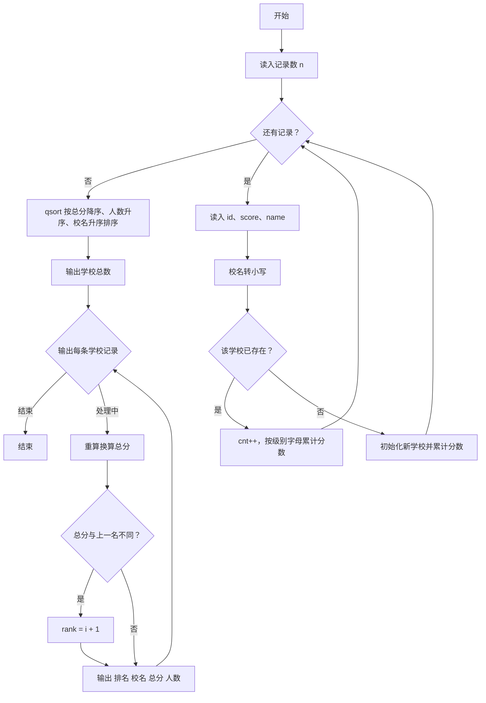
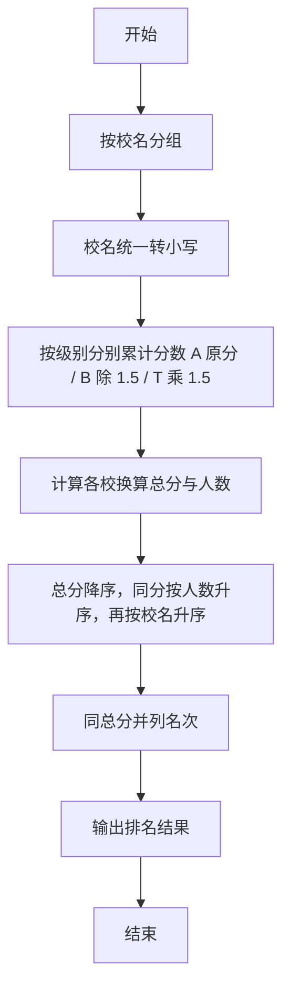

# 1085 PAT单位排行 详解

### 解题思路
- 按校名聚合成绩：每个准考证号首字母表示考试级别——`A` 级原分计入、`B` 级计入后除以 1.5、`T` 级计入后乘以 1.5，最后按"级别换算总和"排序。
- 数据组织：`School` 结构体保存小写校名、三个级别的原始分数累计和 `scoreA/scoreB/scoreT`、参考人数 `cnt`。
- 校名统一转小写后再比较，保证 `PAT` 与 `pat` 视为同一学校；新增学校时使用线性查重并入。
- 排序：`qsort` 比较函数 `cmp` 依次按"换算总分降序 → 人数升序 → 校名字典序升序"三级排序。
- 排名规则：换算总分相同的学校并列同一名次（比较上一个分数是否变化来更新 `rank`），输出顺序按排序结果。
- 注意总分换算在比较函数和输出时都需重新计算，避免排序与输出不一致。
- 时间复杂度：读入合并 O(n×校数)（线性查重），排序 O(m log m)（m 为学校数），n 最大 10^5 可行。

### 代码流程说明
- 读入记录条数 `n`，定义 `schools` 数组与计数 `count`。
- 循环 n 次：读入准考证号 `id`、分数 `score`、校名 `name`；把校名大写转小写。
- 线性查找 `schools` 中是否已有该学校：有则 `cnt++` 并按 `id[0]` 为 `A/B/T` 累加到对应分数；无则初始化新学校并把该记录作为第一笔成绩入账。
- `qsort` 按 `cmp` 排序；先输出学校总数 `count`。
- 输出循环中维护 `prev_score` 与 `rank`：分数变化时 `rank = i + 1`，否则沿用上一名次；每行输出 "排名 校名 总分 人数"。

### 代码流程图

### 解题流程图

