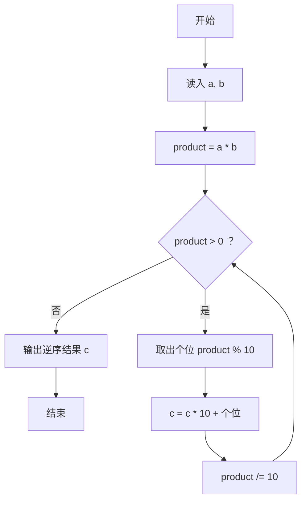
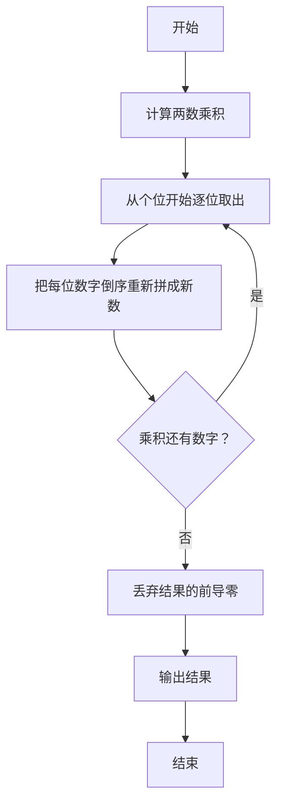

# 1086 就不告诉你 详解

### 解题思路
- 计算 `a * b` 的乘积，然后把乘积的数字倒过来输出，要求去掉前导零。
- 关键技巧：用"取余 + 整除"逐位剥离乘积的个位，并通过 `c = c * 10 + product % 10` 累积成逆序数。
- 由于逆序数用整数存储，乘积末尾的 0（逆序后的前导零）会天然被丢弃，无需单独处理。
- 边界说明：乘积可能很大，但题目保证 `a * b` 在 int 范围内。
- 时间复杂度：O(log(ab))，即乘积的位数次循环。

### 代码流程说明
- 读入整数 `a`、`b`，计算 `product = a * b`，初始化结果 `c = 0`。
- while 循环：只要 `product > 0`，取 `product % 10` 累加到 `c`（`c = c * 10 + 个位`），再 `product /= 10` 去掉已处理的个位。
- 循环结束后输出 `c`。

### 代码流程图

### 解题流程图

