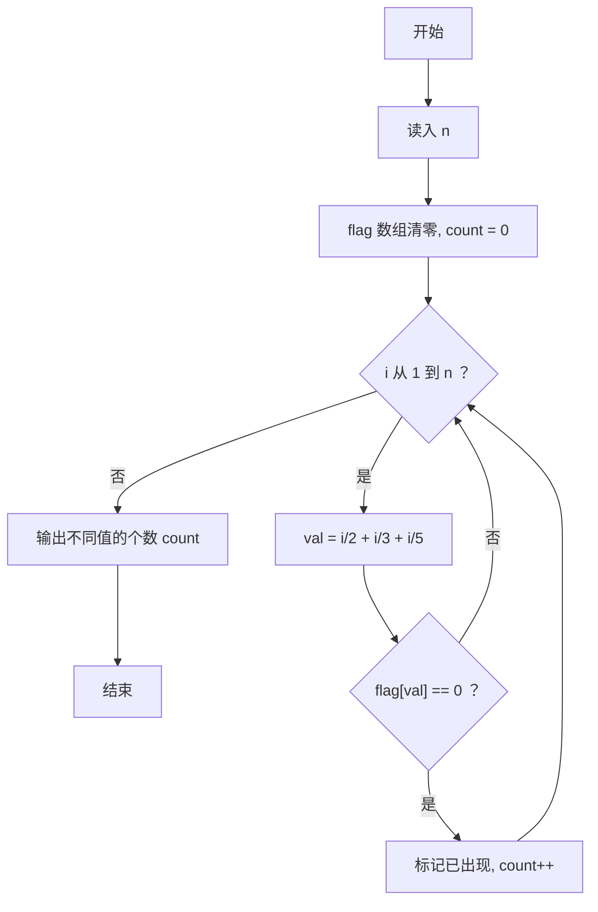
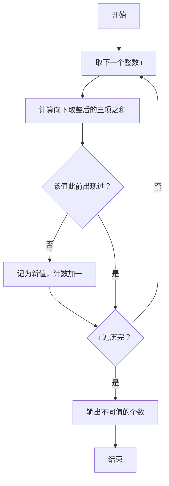

# 1087 有多少不同的值 详解

### 解题思路
- 对每个整数 i（1 到 n），计算表达式 `i/2 + i/3 + i/5` 的值，统计一共有多少种不同的取值。
- 关键点：C 语言整数除法本身就是向下取整，所以 `i/2` 等价于 floor(i/2)，无需额外处理。
- 数据组织：用布尔标记数组 `flag[1000000]` 记录某个值是否已经出现过，首次出现时计数加 1。
- 复杂度：单次线性扫描，时间复杂度 O(n)，空间 O(n)。
- 取值上界：`i/2 + i/3 + i/5` 最大约为 `n/2 + n/3 + n/5`，小于 n，数组大小足够。

### 代码流程说明
- 读入 n，初始化 `flag` 数组全 0、计数 `count = 0`。
- 循环 i 从 1 到 n：计算 `val = i/2 + i/3 + i/5`；若 `flag[val] == 0` 说明首次出现，置 1 并 `count++`。
- 输出 `count`。

### 代码流程图

### 解题流程图

