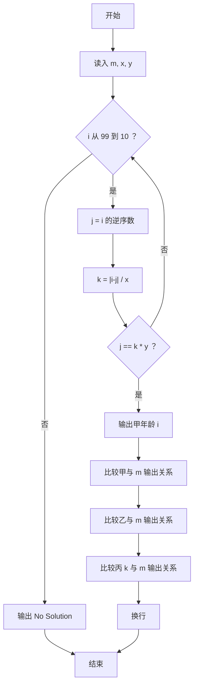
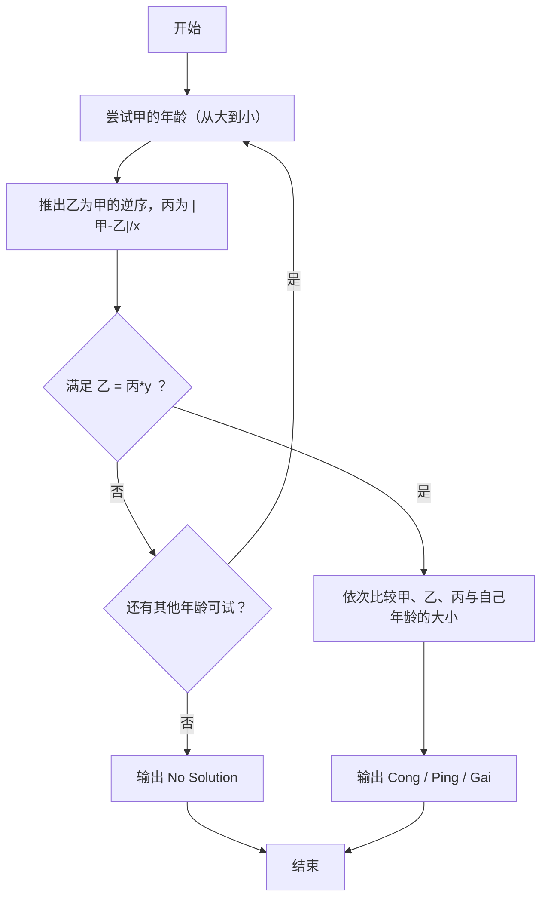

# 1088 三人行 详解

### 解题思路
- 甲是两位数（10~99），乙是甲的逆序数，二者满足"丙 = |甲-乙| / x"且"乙 = 丙 * y"。
- 枚举策略：从 99 到 10 从大到小枚举甲的年龄，第一个满足条件的组合即为字典序最大的解（题目要求无解或按此顺序输出）。
- 关键点：丙可能是小数，因此用 `double` 保存；判断 `j == k * y` 时用浮点比较，输出丙与自己年龄的关系时也要按浮点比较（`k > m`、`(int)k == m`）。
- 关系输出：`print_rel` 函数统一输出 "Cong"（大于）/ "Ping"（等于）/ "Gai"（小于），先输出甲、乙，再单独处理丙（因为丙可能是小数）。
- 时间复杂度：最多枚举 90 个两位数，常数级。

### 代码流程说明
- 读入自己的年龄 `m`、除数 `x`、`y`。
- 循环 `i` 从 99 到 10：由逆序公式 `j = i/10 + (i%10)*10` 得乙；`k = abs(i-j) * 1.0 / x` 得丙（double）。
- 若 `j == k * y` 成立：输出甲的年龄 `i`，调用 `print_rel` 比较甲、乙与 `m` 的大小，再单独用浮点比较输出丙的关系，换行后结束程序。
- 循环结束仍未找到则输出 `No Solution`。

### 代码流程图

### 解题流程图

