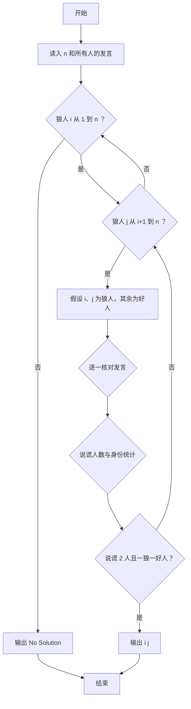
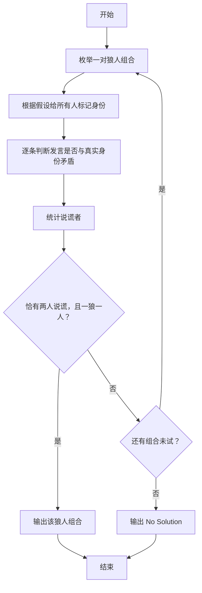

# 1089 狼人杀-简单版 详解

### 解题思路
- 有 n 人，其中恰好 2 个狼人；每个人有一条发言，正数表示"该人是好人"，负数表示"该人是狼人"。已知恰好有 2 人说谎，且说谎者中一个是狼人、一个是好人。
- 暴力枚举：双重循环枚举所有可能的狼人对 (i, j)，对每个假设构造身份数组 `a`（狼人为 -1，好人为 1）。
- 说谎判定：发言者 k 说的人是 `abs(words[k])`，若 `words[k] * a[abs(words[k])] < 0`，说明发言与真实身份相反，即 k 在说谎。
- 合法性检查：说谎人数必须恰好为 2，且 `a[lie[0]] + a[lie[1]] == 0`（一个狼人一个好人）。
- 枚举顺序保证 i 从小到大、j 从小到大，第一个满足条件的组合就是题目要求的答案；无解输出 `No Solution`。
- 时间复杂度：O(n³)（n ≤ 100，组合数约 5000 对 × 每人检查）。

### 代码流程说明
- 读入人数 n 和每个人的发言存入 `words[1..n]`。
- 外层枚举狼人 i（1 到 n），内层枚举狼人 j（i+1 到 n）。
- 初始化 `a` 全部为 1，令 `a[i] = a[j] = -1`。
- 逐人核对：若 `words[k] * a[abs(words[k])] < 0` 则把 k 记入 `lie` 数组并计数。
- 若 `lie_cnt == 2` 且两人身份相加为 0，输出 i、j 并结束。
- 全部组合不成立则输出 `No Solution`。

### 代码流程图

### 解题流程图

