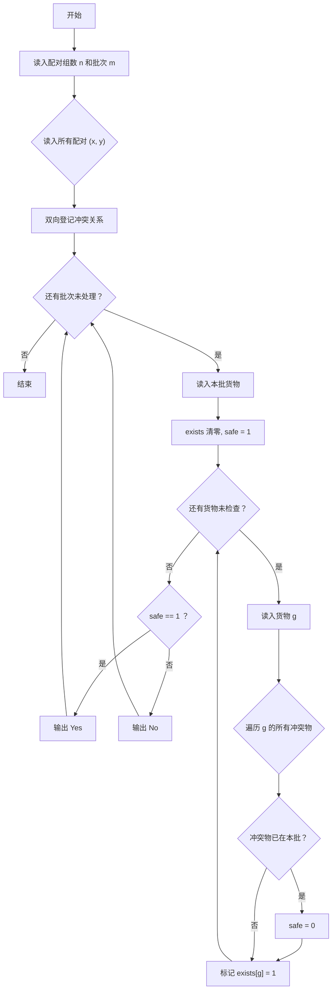
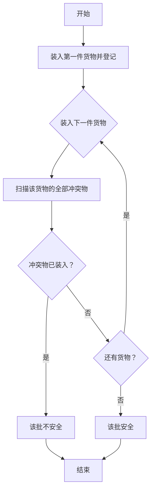

# 1090 危险品装箱 详解

### 解题思路
- 题目给出若干组"互为危险品"的配对，要求判断每批货物中是否同时装入了互为危险品的两件物品。
- 数据组织：用邻接表存储冲突关系——`conflict[x]` 是数组，存与物品 x 冲突的所有物品，`conflict_cnt[x]` 记录冲突物品个数；冲突是双向的，读入 (x,y) 时要向两个方向各登记一次。
- 判断技巧：对每批货物用一个 `exists` 布尔数组标记"已装入"的物品，然后逐件检查：当前物品的所有冲突物是否已在箱中，只要有一个在箱中就判定不安全。
- 由于是逐件处理、边检查边标记，后装入的物品在检查时只可能查到"更早装入"的冲突物，与顺序无关，结果正确。
- 复杂度：读入 O(n)，每批检查 O(k × 平均冲突数)，k ≤ 1000，n ≤ 10^5，可行。

### 代码流程说明
- 读入配对组数 `n` 和批次 `m`；清空 `conflict` 和 `conflict_cnt`。
- 循环读入 n 组配对 (x, y)：`conflict[x][cnt[x]++] = y`，`conflict[y][cnt[y]++] = x`（双向登记）。
- 对每批：读入货物件数 `k` 与所有货物，`exists` 清 0，`safe = 1`。
- 逐件处理货物 g：遍历 `conflict[g]` 中所有冲突物品，若某冲突物 `exists` 为 1 则 `safe = 0`；处理完后再把 `exists[g] = 1`。
- 根据 `safe` 输出 "Yes" 或 "No"。

### 代码流程图

### 解题流程图

