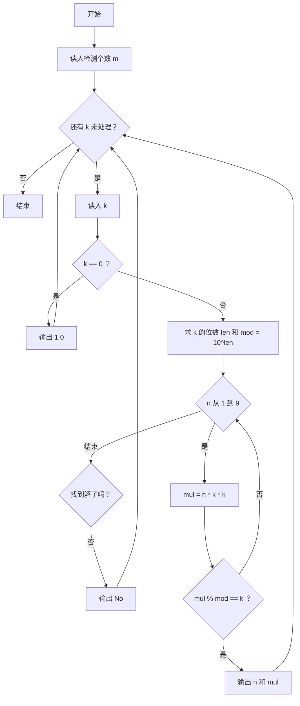
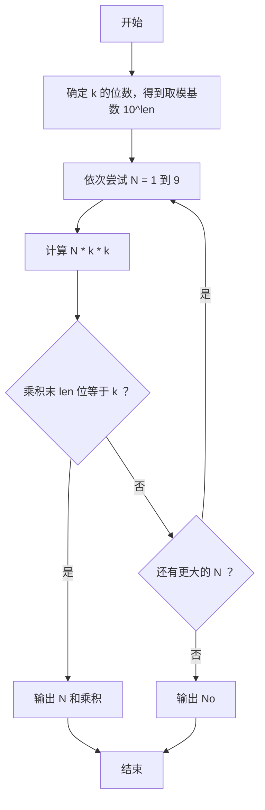

# 1091 N-自守数 详解

### 解题思路
- 若存在 N（1~9）使得 `N * k * k` 的末尾若干位恰好等于 k，则 k 是 N-自守数。
- 关键技巧：先求 k 的位数 `len`，令 `mod = 10^len`，那么 `(N*k*k) % mod` 就是乘积的末 len 位，用它和 k 比较即可，无需字符串操作。
- 枚举 N 从 1 到 9，找到第一个满足条件的 N 就输出"该 N 与乘积"；全部不满足输出 `No`。
- 注意溢出：`n * k * k` 用 `long long` 计算（k 最大 1000，平方后再乘 9 也在 int 内，但加保险）。
- 特例：k = 0 时位数为 0，直接特殊处理输出 `1 0`（1×0²=0，末 1 位为 0，是 1-自守数）。
- 时间复杂度：每个 k 最多 9 次尝试，常数级。

### 代码流程说明
- 读入检测个数 `m`，循环处理每个 k。
- 若 `k == 0` 直接输出 `1 0` 并继续下一个。
- 否则用 while 求 k 的位数 `len`，再循环 `len` 次累乘得到 `mod = 10^len`。
- 枚举 `n` 从 1 到 9：计算 `mul = (long long)n * k * k`，若 `mul % mod == k` 则输出 `n` 和 `mul`、置 `flag = 1` 并跳出。
- `flag` 仍为 0 时输出 `No`。

### 代码流程图

### 解题流程图

