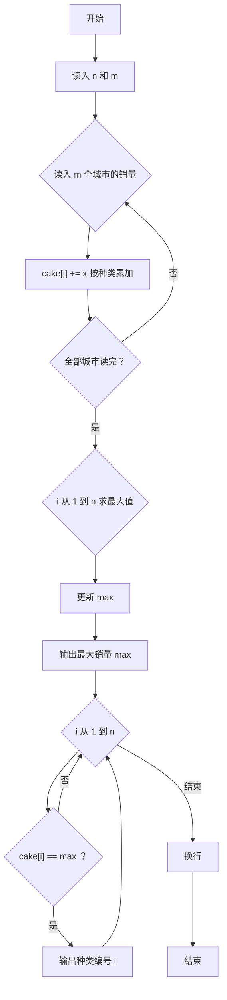
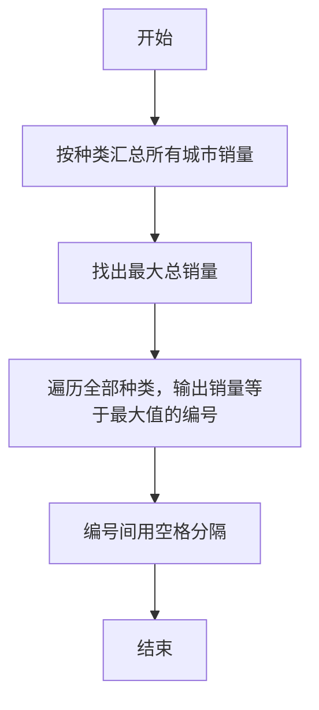

# 1092 最好吃的月饼 详解

### 解题思路
- m 个城市分别给出 n 种月饼的销量，把每种月饼在各城市的销量累加，找出总销量最大的种类。
- 数据组织：一维数组 `cake[1..n]` 按种类累加销量，读入时外层循环城市、内层循环种类，直接 `cake[j] += x`。
- 两遍扫描：第一遍求最大值 `max`，第二遍输出所有销量等于 `max` 的种类编号（并列第一的全部输出）。
- 输出格式：编号之间用空格分隔，行末换行，用 `first` 标志控制是否输出空格。
- 时间复杂度：读入 O(m×n)，求最值与输出 O(n)。

### 代码流程说明
- 读入种类数 `n` 和城市数 `m`，`cake` 数组清零。
- 双层循环读入 m×n 个销量，内层按种类 `j` 累加到 `cake[j]`。
- 遍历 1 到 n 求出最大销量 `max`，先输出 `max` 换行。
- 再遍历 1 到 n，凡是 `cake[i] == max` 的种类，按 `first` 标志控制空格依次输出编号，最后换行。

### 代码流程图

### 解题流程图

