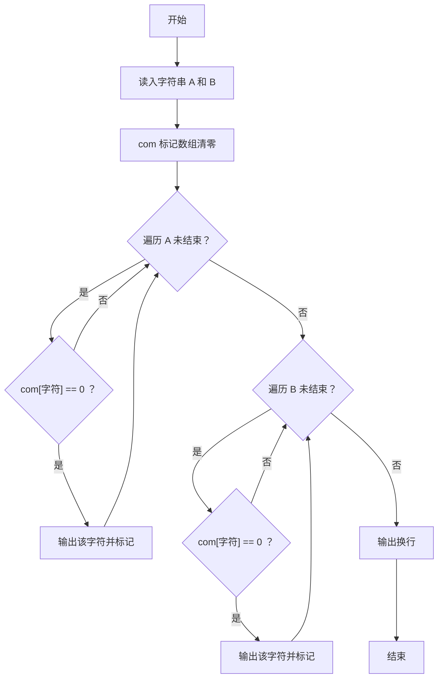
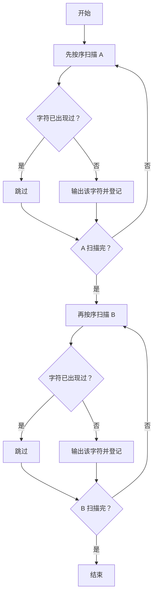

# 1093 字符串A+B 详解

### 解题思路
- 把字符串 A 和 B 合并输出，要求去掉重复字符，且保留各字符"首次出现"的顺序。
- 数据组织：布尔标记数组 `com[129]`，以字符的 ASCII 码为下标，记录某字符是否已经输出过。
- 处理顺序：先完整输出 A 中的首次出现字符，再处理 B，B 与 A 共用同一个标记数组，因此 B 中已在 A 出现过的字符会被跳过。
- 细节：字符可能为负值（如扩展字符），用 `(unsigned char)` 强制转换后再作下标，防止数组越界。
- 时间复杂度：O(lenA + lenB)，两次线性扫描。

### 代码流程说明
- `gets` 分别读入 A、B 两个字符串，初始化 `com` 全 0。
- 第一次 for 循环遍历 A：字符 `temp` 若 `com[(unsigned char)temp] == 0` 则输出并置标记 1。
- 第二次 for 循环遍历 B：同样的去重判断，输出 A 中未出现过的字符。
- 最后输出换行。

### 代码流程图

### 解题流程图

