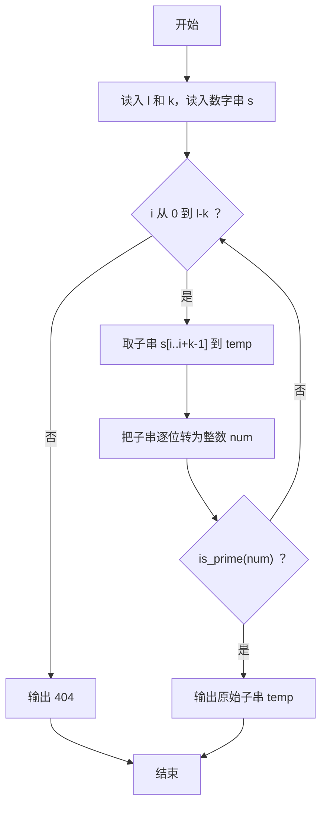
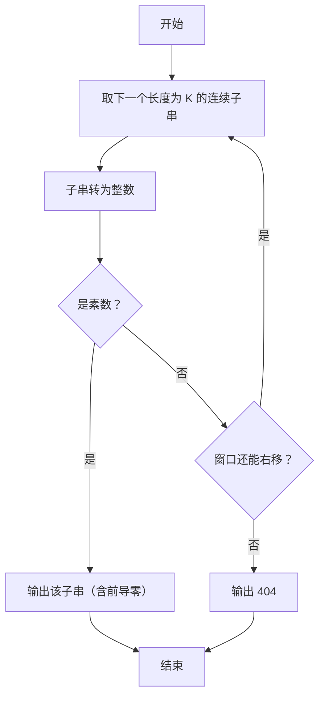

# 1094 谷歌的招聘 详解

### 解题思路
- 在长度为 L 的数字串中找第一个长度为 K 的连续子串，使其对应的整数是素数。
- 滑动窗口：用 `strncpy` 截取 `s[i..i+k-1]` 作为子串，`i` 从 0 遍历到 `L-K`。
- 子串转整数：逐位 `num = num * 10 + 数字`，注意要保留前导零（输出时用原始子串 `temp` 而非数字）。
- 素数判定 `is_prime`：排除 ≤1 和偶数，只从 3 开始检查奇数因子直到 `i*i <= x`，复杂度 O(√x)。
- 输出细节：找到的第一个素数输出**原始子串**（保留前导 0）；找不到输出 `404`。
- 时间复杂度：最多 L-K+1 个子串，每个子串转数字 O(K)、判素 O(√(10^K))，K 最大 9，可行。

### 代码流程说明
- 读入长度 `l` 和位数 `k`，`getchar()` 吃掉换行后 `gets` 读入数字串 `s`。
- 外层循环 `i` 从 0 到 `l-k`：`strncpy` 取 K 位到 `temp`，补 `'\0'`。
- 内层循环把 `temp` 逐位拼成整数 `num`。
- 调用 `is_prime(num)`，是素数则直接 `printf("%s", temp)` 输出原始子串并结束；否则继续下一个子串。
- 循环结束未找到，输出 `404`。

### 代码流程图

### 解题流程图

