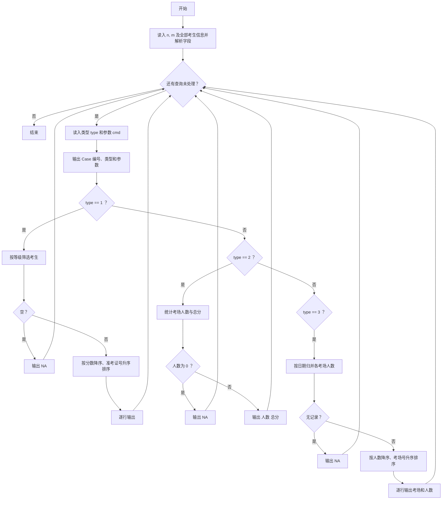
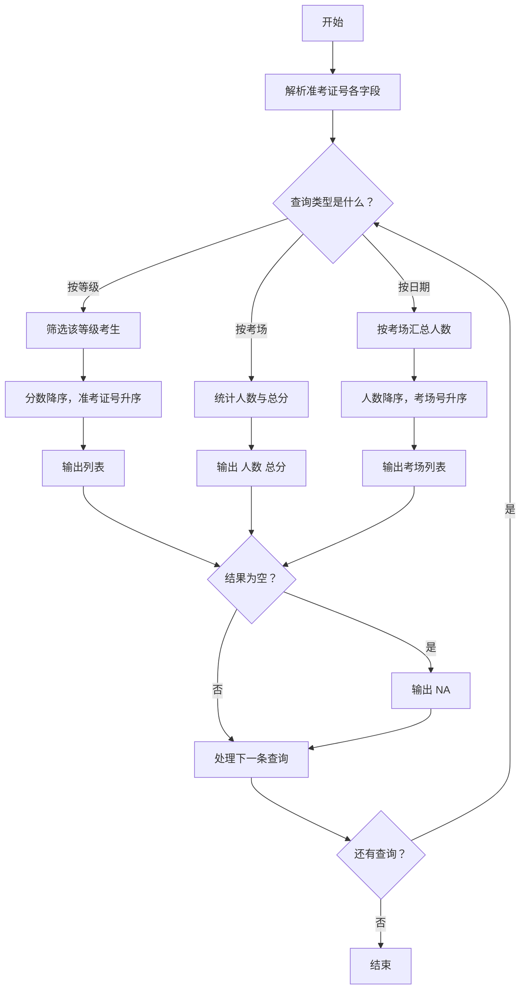

# 1095 解码PAT准考证 详解

### 解题思路
- 准考证号 13 位：等级（1 位）＋考场号（3 位）＋日期（6 位）＋考生号（3 位），读入时用 `strncpy` 一次性解析成 `level / room / date / id` 四个字段存入结构体，供后续查询复用。
- 三种查询：
  - 类型 1（按等级）：筛出等级匹配的考生，按分数降序、准考证号升序（`qsort` + `cmp1`）输出；无人则输出 `NA`。
  - 类型 2（按考场）：线性扫描统计人数和总分；人数为 0 输出 `NA`。
  - 类型 3（按日期）：统计该日期下各考场的人数，考场号转整数作下标用 `exist` 数组实现"查重 + 定位"，再按人数降序、考场号升序（`cmp3`）输出。
- 输出格式：每条查询先输出 `Case i: 类型 参数` 一行，再输出查询结果。
- 复杂度：三种类型均为 O(n log n)（排序）或 O(n)（统计），n ≤ 10^4、查询数 m ≤ 10^4，可行。

### 代码流程说明
- 读入考生数 n 和查询数 m；读入 n 个准考证号和分数，解析出 `level`（第 0 位）、`room`（第 1~3 位）、`date`（第 4~9 位）、`id`（第 10~12 位），字段末尾补 `'\0'`。
- 循环 m 次处理查询：读入类型 `type` 和参数 `cmd`，先打印 `Case i: type cmd`。
- 类型 1：遍历所有考生，`level == cmd[0]` 的拷入 `S1` 数组，空则 `NA`，否则 `qsort` 后逐行输出。
- 类型 2：遍历考生，`room` 相等则人数加 1、总分累加，输出 `人数 总分` 或 `NA`。
- 类型 3：遍历考生，`date` 匹配的按考场号查 `exist`：首次出现则新建 `S3` 记录并记下标，否则对应记录 `cnt++`；空则 `NA`，否则 `qsort` 后输出考场与人数。

### 代码流程图

### 解题流程图

