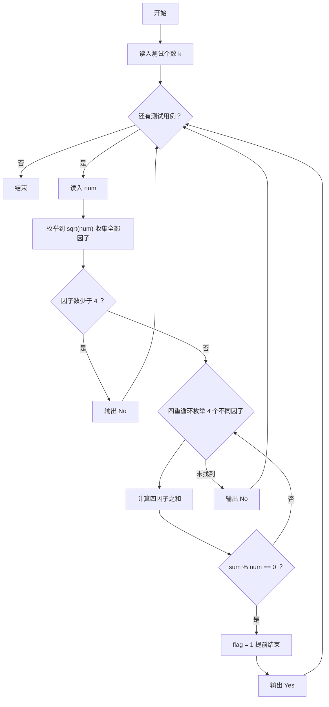
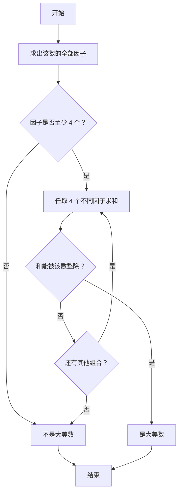

# 1096 大美数 详解

### 解题思路
- 大美数定义：存在 4 个不同的正整数因子，且这 4 个因子之和能被该数整除。
- 求因子：枚举到 √num，每找到一个因子 j 就把成对的 j 和 num/j 都存入 `factors` 数组（二者相等时只存一次）。
- 剪枝：因子总数不足 4 个时直接判定不是大美数。
- 组合枚举：四重循环从因子数组中取下标递增的 4 个不同因子，检查四者和 `sum % num == 0`，找到一组即可置标志并提前结束（每层循环条件都带 `!flag`）。
- 复杂度：因子个数远小于 √num，四重组合 C(cnt,4)，num 最大 10^9 时因子数约 1 千多，最坏情况可接受（k 较小）。

### 代码流程说明
- 读入测试个数 `k`，循环处理每个数 `num`。
- 枚举 `j` 从 1 到 `j*j <= num`：能整除则把 `j` 与 `num/j`（去重）存入 `factors`，记 `cnt`。
- `cnt < 4` 输出 `No` 并 `continue`。
- 四重循环 a<b<c<d 枚举因子组合，计算四者和，若 `sum % num == 0` 则 `flag = 1`。
- 输出 `flag ? "Yes" : "No"`。

### 代码流程图

### 解题流程图

