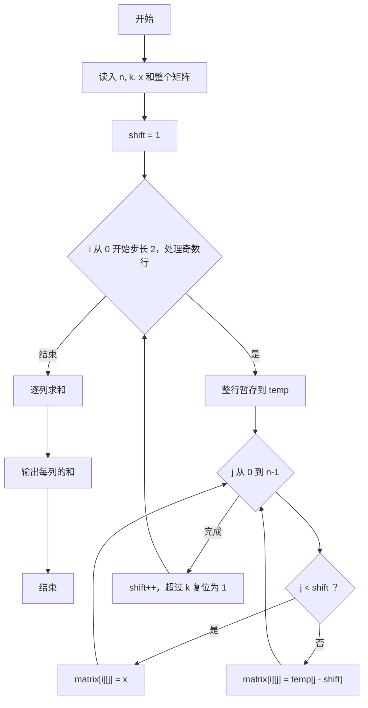
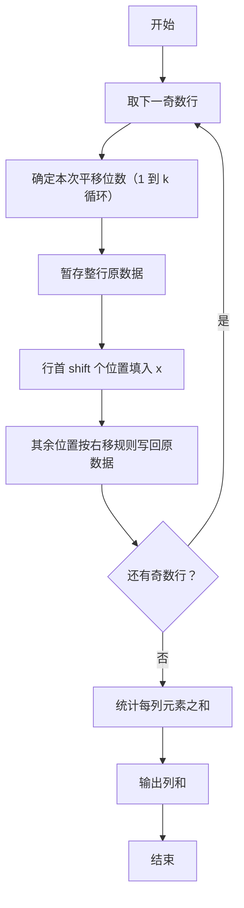

# 1097 矩阵行平移 详解

### 解题思路
- 对矩阵的奇数行（第 1、3、5…行，即数组下标 0、2、4…）执行向右平移，平移位数从 1 递增到 k 后循环重复（1、2、…、k、1、2、…）。
- 平移规则：行内元素整体右移 `shift` 位，左端空出的 `shift` 个位置全部填入给定的数字 `x`。
- 实现技巧：先把整行拷入临时数组 `temp`，再回写——前 `shift` 位填 `x`，其余位置写 `temp[j - shift]`。
- 平移位数维护：每次处理后 `shift++`，超过 k 就重置为 1。
- 最后逐列累加输出列和，列之间用空格分隔。
- 时间复杂度：读入 O(n²)，平移处理 O(n²)，列求和 O(n²)。

### 代码流程说明
- 读入阶数 `n`、循环周期 `k`、填充值 `x`，读入整个 `matrix`。
- 初始化 `shift = 1`；`for` 循环 `i` 从 0 开始、步长 2，只处理奇数行。
- 每行：先把整行暂存到 `temp`，再按规则回写（`j < shift` 填 `x`，否则填 `temp[j - shift]`）；随后 `shift++` 并在超过 k 时复位为 1。
- 逐列求和：内层循环累加该列所有元素，`j > 0` 时先输出空格再输出和；最后换行。

### 代码流程图

### 解题流程图

