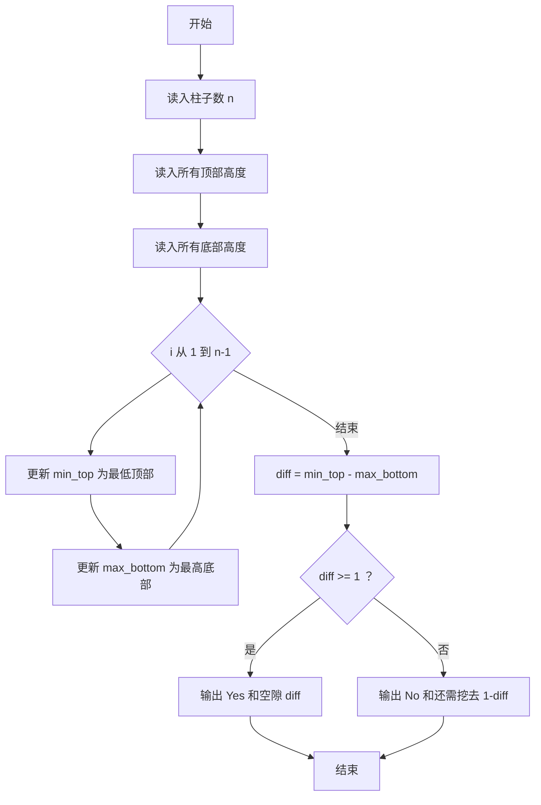
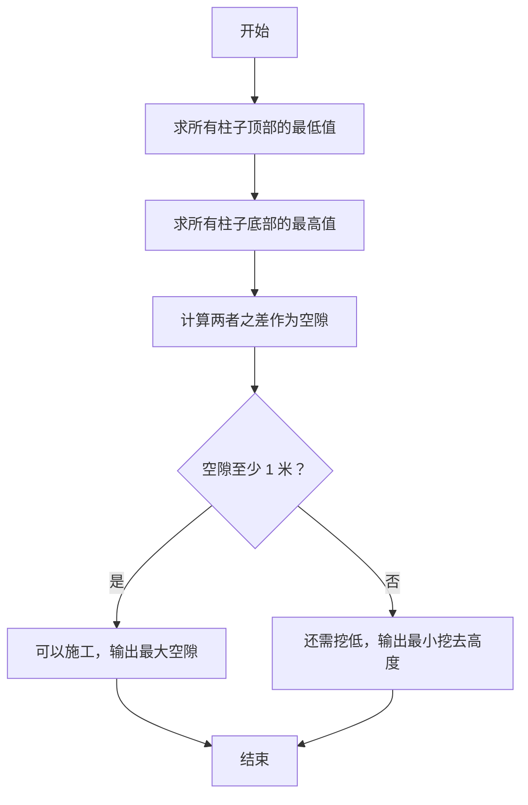

# 1098 岩洞施工 详解

### 解题思路
- 岩洞由若干柱子支撑，每根柱子给出顶部高度 `top` 和底部高度 `bottom`；要在柱子间水平搭木板，木板高度不能高于任何一根柱子的顶部，也不能低于任何一根柱子的底部。
- 因此可放置木板的区间为 `[max_bottom, min_top]`（所有底部最高点之上、所有顶部最低点之下）。
- 施工可行性：区间长度 `diff = min_top - max_bottom`。若 `diff >= 1`（至少 1 米空隙）可施工，最大空隙就是 `diff`；否则不能施工，还需挖去的最小高度为 `1 - diff`。
- 数据组织：只需两个数组分别存顶部和底部高度，再各求一次最值即可，无需二维存储。
- 时间复杂度：O(n)，一次读入加一次扫描。

### 代码流程说明
- 读入柱子数 `n`，分别读入 `top[0..n-1]` 和 `bottom[0..n-1]`。
- 初始化 `min_top = top[0]`、`max_bottom = bottom[0]`，循环 i 从 1 到 n-1 更新最低顶部与最高底部。
- 计算 `diff = min_top - max_bottom`：`diff >= 1` 时输出 `Yes diff`，否则输出 `No 1-diff`。

### 代码流程图

### 解题流程图

