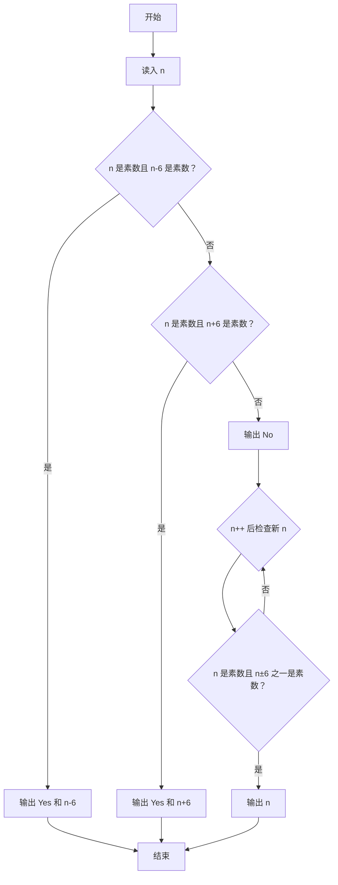
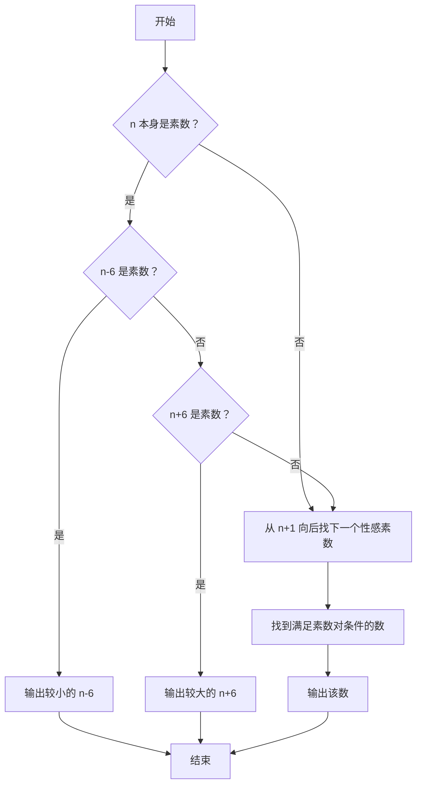

# 1099 性感素数 详解

### 解题思路
- 性感素数：一对相差 6 的素数。判断 n 是否为性感素数要看 `n-6` 或 `n+6` 是否也是素数。
- 输出规则：n 本身是素数且 n-6 也是素数时，输出较小的 `n-6`；否则若 n+6 是素数则输出较大的 `n+6`；都不满足则输出 `No` 并继续向后找下一个性感素数。
- 素数判定 `is_prime`：排除 ≤1 与偶数，只试除奇数因子到 √n，复杂度 O(√n)。
- 向后查找：从 n+1 开始逐个递增，第一个满足"自身为素数且 n±6 之一为素数"的数即为答案。
- 边界：判断 `n - 6` 时若为负数或 0、1，`is_prime` 会正确返回 0，无需特判。
- 时间复杂度：素数判定 O(√n)，向后探测的次数通常很小。

### 代码流程说明
- 读入 n。
- 依次检查两个条件：`is_prime(n) && is_prime(n-6)` 成立则输出 `Yes` 和 `n-6` 结束；否则 `is_prime(n) && is_prime(n+6)` 成立则输出 `Yes` 和 `n+6` 结束。
- 两个条件都不满足：先输出 `No`，再进入 while 循环 `n++`，找到 `is_prime(n) && (is_prime(n-6) || is_prime(n+6))` 的数输出并跳出。

### 代码流程图

### 解题流程图

